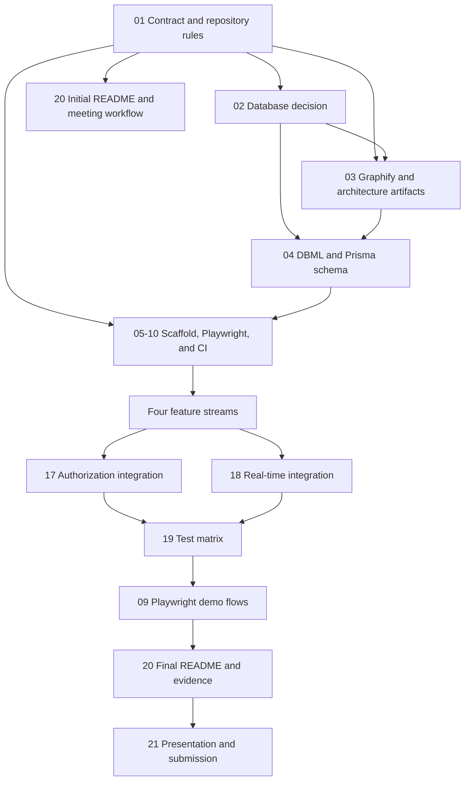

# HealthAccess Project Plan

**Deadline:** Friday, October 2, 2026 at 11:00  
**Team:** 4 developers  
**Working rule:** no direct commits to `main`; every change goes through a pull request and review.

## North Star

Deliver one reliable, demonstrable flow:

1. A user logs in with one of five roles.
2. An authorized healthcare user searches for a patient and opens the journal.
3. The server stores medical data in SQL, never on the blockchain.
4. Every journal access creates an access-log entry that is distributed across two running servers and represented in the blockchain.
5. Notes obey private, healthcare-only, and all-users visibility rules.
6. The patient sees their own permitted notes and the complete access-log view; unauthorized users see only an access-denied page.

The project must also leave behind understandable evidence: a working README, meeting notes, a DBML schema, Mermaid diagrams, API documentation, tests, screenshots, and the two approved graphify artifacts.

## Requirements Loop

`docs/Raw_Requirements.txt` is the controlling source for scope. The team must deliberately loop back to it throughout the project instead of treating the initial planning meeting as a one-time requirements read.

- At every planning meeting, review the raw requirements and confirm that the next tasks map to a named requirement.
- At least twice per week, use a short requirements checkpoint in the meeting notes: `covered`, `unclear`, `missing evidence`, and `next action`.
- Every feature PR links its acceptance criteria to the relevant raw-requirements section and states which requirement is still not covered, if any.
- For every user-facing behavior, write or update an acceptance test before implementation. The test may initially fail, but it must express the intended behavior and the raw requirement it covers.
- At each weekly demo, walk through the required user flow and compare the result against the raw requirements, not only against the task board.
- Before integration, testing, and submission, perform a full checklist pass over the raw requirements and record the result in a meeting note or release checklist.
- If a proposed feature is not required and risks delaying the required flow, defer it until the MVP is demonstrably complete.

## Operating Model

### Roles

Use temporary labels until the group contract records real names.

| Person | Primary ownership | Backup ownership |
|---|---|---|
| Person 1 | Scaffold pair, backend/auth | Integration |
| Person 2 | Scaffold pair, frontend shell | UI and accessibility |
| Person 3 | Database, patient/record domain | Test data and API tests |
| Person 4 | Blockchain, P2P, Socket.IO | Documentation and demo |

Person 1 and Person 2 pair-program the initial scaffold. No feature branch should create a competing root package, app shell, configuration, or directory layout.

### Collaboration Rules

- Each feature has one primary owner and one reviewer from another stream.
- Keep shared files stable: `package.json`, lockfiles, routing entry points, API schemas, Prisma schema, and global styles are changed only through an explicit reviewed integration task.
- Use short-lived branches named `feature/<task-id>-<topic>` or `chore/<task-id>-<topic>`.
- Open a draft PR early; merge only when CI passes and the assigned reviewer has approved it.
- Hold at least two documented project meetings per week. Every meeting note records decisions, blockers, owners, and next steps.
- Rotate facilitator, timekeeper, and note-taker roles so the operational work is shared. The note-taker publishes the meeting note in `docs/meetings/` the same day.
- Use [MEETING_TEMPLATE.md](MEETING_TEMPLATE.md) for every planning meeting, standup, review, and retrospective.
- Demo a thin vertical slice at the end of every week; unfinished work is re-scoped against the MVP instead of silently carried forward.

The default rotation is alphabetical by person each week: the next person facilitates, the following person keeps time, and the third person takes notes. A swap is fine, but the meeting note records the actual assignments. Replace temporary labels with real names in the group contract.

## Dependency Gates

No stream starts until Gate 1 is met. Database-dependent backend work starts only after Gate 2. Cross-stream integration starts only after each stream has a reviewed contract and a narrow test.

## Ordered Work

### Gate 1: Decisions, contract, and repository hygiene
**September 2-3 | Team + scaffold pair**

1. **01** - Sign `gruppkontrakt.md`, agree on roles, meetings, PR review, branch rules, and definition of done.
2. **02** - Decide PostgreSQL for the shared two-server scenario; record the rejected alternatives and local setup decision.
3. **03** - Run graphify on the initial repository and check in only `graphify-out/graph.html` and `graphify-out/GRAPH_REPORT.md`. Create the Mermaid system-context, data-flow, and access-log sequence diagrams.
4. **20 (initial slice)** - Create the README skeleton, project purpose, architecture links, setup placeholder, team section, and meeting-note index.

**Gate 1 exit:** contract is agreed, GitHub rules are active, decisions are written, the README points to the planned artifacts, and the graphify ignore policy is tested.

The Gate 1 meeting note must also contain the first requirements checkpoint against `docs/Raw_Requirements.txt`.

### Gate 2: Paired scaffold and executable contracts
**September 3-5 | Person 1 + Person 2 pair; Persons 3 + 4 review**

5. **04** - Create `database/schema.dbml`, the Prisma schema, migration strategy, fictional seed data, and the Mermaid data-model diagram. Keep all four representations aligned.
6. **05, 06, 07, 08, 09, 10** - Build one monorepo scaffold, strict TypeScript, lint/format, Playwright runner and fixtures, CI, environment examples, and local commands.
7. **09 first test** - Before feature implementation, write the first Playwright smoke test for the login page/app shell. Run it red if the page does not exist yet, then keep it as the first green scaffold gate.
8. Define the OpenAPI contract and generated client types before feature streams fork. Add health checks and a minimal frontend-to-backend request.

**Gate 2 exit:** a clean checkout installs, lint/typecheck/build pass, frontend and backend both start, database migration/seed works, and the README setup steps work for one teammate.

Run a second raw-requirements checkpoint at this gate and remove or re-plan anything that does not support the required demo.

### Gate 3: Four parallel feature streams
**September 6-16 | Four owners, separate files and branches**

| Stream | Primary tasks | Contract to freeze |
|---|---|---|
| A - Identity | **11**, authentication hooks/pages | login response, session/token behavior, five role enum values |
| B - Patient access | **13**, patient search and patient view | patient search and record response shapes |
| C - Notes and records | **14**, record display and note creation | note visibility enum and filtering rules |
| D - Audit distribution | **15**, **16**, blockchain access log and two-server P2P transport | append-only log payload, server identity, chain verification |

Frontend work may use fixtures generated from the OpenAPI contract. Backend work may use seeded data. Owners do not edit another stream's files without a review note and an integration branch.

Every stream follows the same small loop: write acceptance cases, implement the smallest behavior, run the focused test, then refactor only after it is green. The first test cases must cover the requirement's happy path and one relevant denial or error path.

### Gate 4: Authorization and real-time integration
**September 17-21 | Team integration pairings**

8. **17** - Centralize authorization policy and verify every route server-side; URL manipulation must never expose another patient's data.
9. **18** - Connect Socket.IO broadcasting so a note written on server 1 appears on server 2 only for users allowed to see it.
10. Run the vertical demo: login, search, view, note visibility, access denied, blockchain log, and two-server propagation.

**Gate 4 exit:** the vertical flow works on a clean database with two server processes, and integration bugs have owners in the board.

Compare the working vertical flow line by line with `docs/Raw_Requirements.txt` before declaring this gate complete.

### Gate 5: Evidence, regression, and delivery
**September 22-30 | Team**

11. **19** - Unit/integration tests for policy, visibility, URL tampering, access-log creation, and blockchain immutability boundary.
12. **09** - Expand the early Playwright setup into critical role-based flows and the two-server demo; capture stable screenshots.
13. **20 (final slice)** - Complete README: prerequisites, commands, environment variables, migrations, DBML, diagrams, graphify regeneration, screenshots, API link, privacy boundary, team contributions, demo script, and meeting notes.
14. **21** - Rehearse the ten-minute presentation, explain four genuine challenges and solutions, verify the public/collaborator repository requirement, and perform the final GitHub checkout test.

**Submission gate:** `main` is green, the repository contains no secrets or medical data, required artifacts are linked, at least two meetings per week are documented, and the exact demo works before class.

The final checklist must include a signed-off raw-requirements pass, with evidence links for every required behavior and a named owner for every remaining risk.

## MVP Cut Line

Protect these first: five-role login, patient search, journal view, server-side authorization, visibility-filtered notes, SQL storage, blockchain access logging, two servers, and basic Socket.IO propagation. Defer advanced styling, passwordless login/passkeys, performance work, and nonessential blockchain features until the MVP demo is reliable.

## Required Artifact Locations

- `README.md`
- `database/schema.dbml`
- `docs/diagrams/*.mmd`
- `docs/meetings/*.md`
- `graphify-out/graph.html`
- `graphify-out/GRAPH_REPORT.md`
- `src/backend/prisma/schema.prisma`

## Sources Consulted

- [npm workspaces documentation](https://docs.npmjs.com/cli/v11/using-npm/workspaces) - root-managed workspace commands and dependency linking.
- [DBML documentation](https://dbml.dbdiagram.io/docs/) - tables, enums, indexes, sample records, and relationships.
- [GitHub rulesets documentation](https://docs.github.com/en/repositories/configuring-branches-and-merges-in-your-repository/managing-rulesets/about-rulesets) - branch and push controls for the PR-only workflow.
- [Mermaid documentation](https://mermaid.js.org/intro/) - repository-readable diagrams and supported diagram syntax.