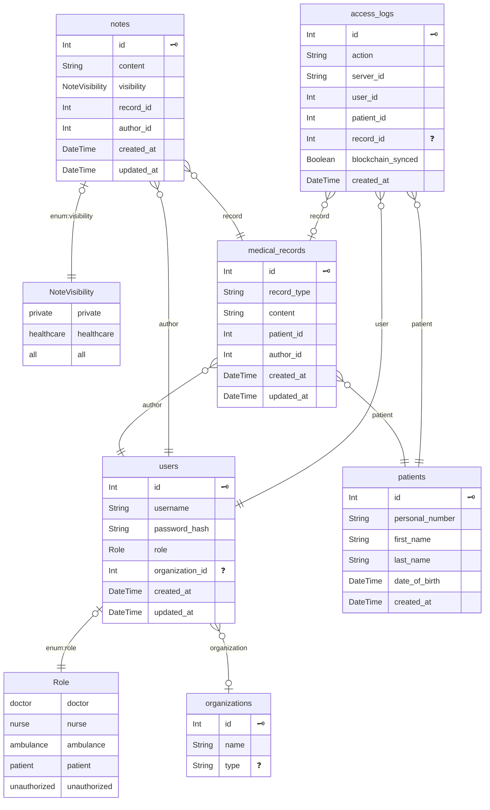

```mermaid
erDiagram

        Role {
            doctor doctor
nurse nurse
ambulance ambulance
patient patient
unauthorized unauthorized
        }
    


        NoteVisibility {
            private private
healthcare healthcare
all all
        }
    
  "organizations" {
    Int id "🗝️"
    String name 
    String type "❓"
    }
  

  "users" {
    Int id "🗝️"
    String username 
    String password_hash 
    Role role 
    Int organization_id "❓"
    DateTime created_at 
    DateTime updated_at 
    }
  

  "patients" {
    Int id "🗝️"
    String personal_number 
    String first_name 
    String last_name 
    DateTime date_of_birth 
    DateTime created_at 
    }
  

  "medical_records" {
    Int id "🗝️"
    String record_type 
    String content 
    Int patient_id 
    Int author_id 
    DateTime created_at 
    DateTime updated_at 
    }
  

  "notes" {
    Int id "🗝️"
    String content 
    NoteVisibility visibility 
    Int record_id 
    Int author_id 
    DateTime created_at 
    DateTime updated_at 
    }
  

  "access_logs" {
    Int id "🗝️"
    String action 
    String server_id 
    Int user_id 
    Int patient_id 
    Int record_id "❓"
    Boolean blockchain_synced 
    DateTime created_at 
    }
  
    "users" |o--|| "Role" : "enum:role"
    "users" }o--|o "organizations" : "organization"
    "medical_records" }o--|| "patients" : "patient"
    "medical_records" }o--|| "users" : "author"
    "notes" |o--|| "NoteVisibility" : "enum:visibility"
    "notes" }o--|| "medical_records" : "record"
    "notes" }o--|| "users" : "author"
    "access_logs" }o--|| "users" : "user"
    "access_logs" }o--|| "patients" : "patient"
    "access_logs" }o--|o "medical_records" : "record"
```
