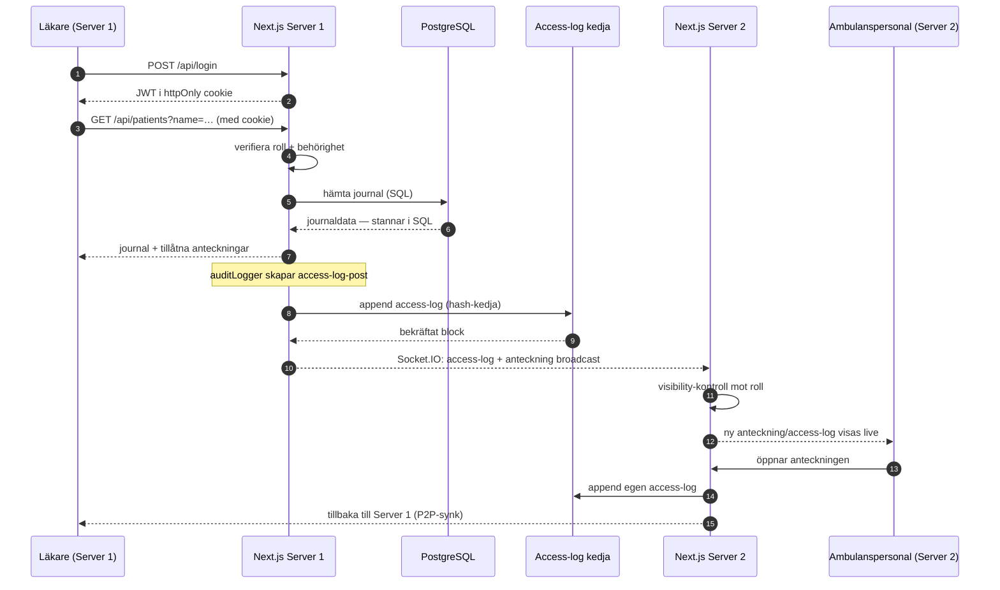

# Sequence: Permitted Read → Access Log → P2P

En behörig användare läser en journal på Server 1. Den medicinska datan hämtas
från PostgreSQL (stannar i SQL), en access-log läggs på blockkedjan och
distribueras till Server 2, där en annan behörig användare ser händelsen live
via Socket.IO — och även den läsningen loggas.

