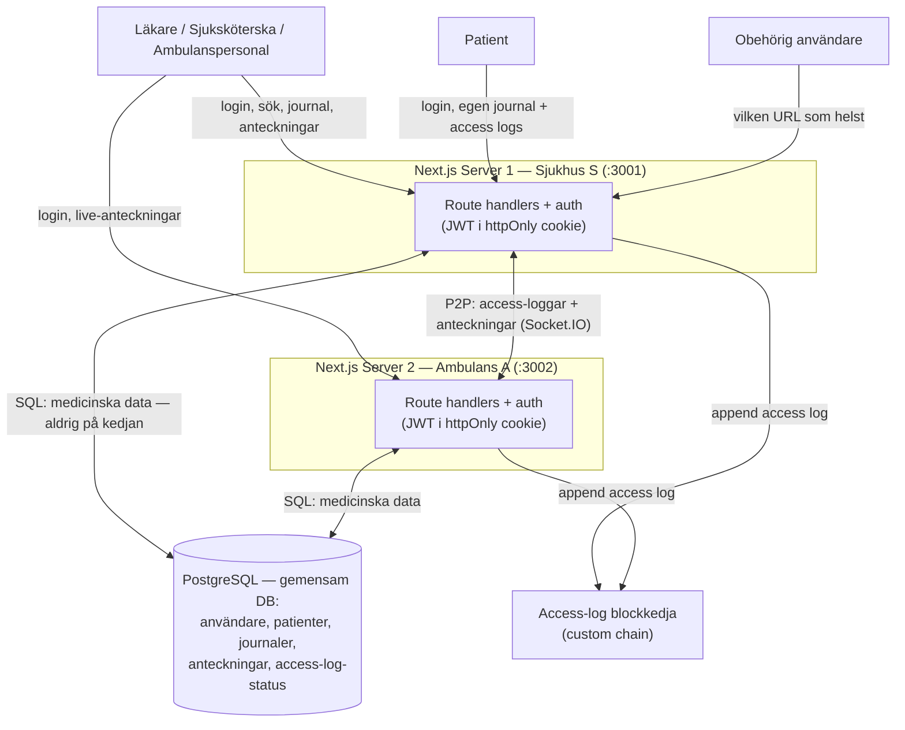

# System Context

HealthAccess körs som **två fullstack Next.js-servrar** (t.ex. Sjukhus S och
Ambulans A) som delar en PostgreSQL-databas för medicinska data. Varje
journal-åtkomst loggas till en gemensam access-log-blockkedja; inga medicinska
uppgifter hamnar på kedjan. Aktörerna är vårdpersonal, patienten själv och
obehöriga användare — alla med olika behörighet.

