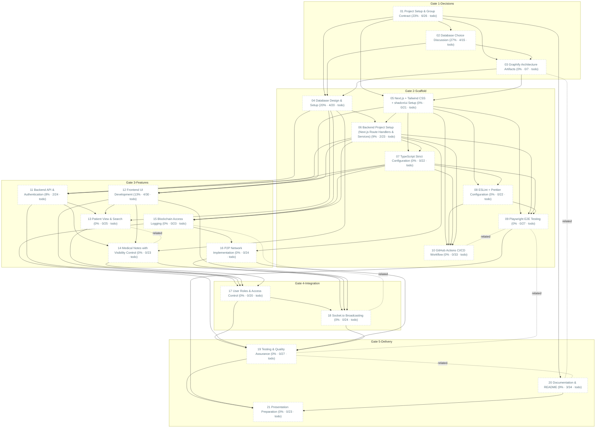

# Task Dependency Graph

_Auto-generated from the draft tasks in `docs/draft_tasks/`. Do not edit by hand._

Regenerate whenever task metadata changes:

```bash
python3 -m project_management plan graph --output docs/diagrams/task-dependencies.md
```

## Legend

| Symbol | Meaning |
|---|---|
| `A --> B` (solid arrow) | B depends on A — B is **blocked by** A |
| `A -. related .- B` (dotted line) | A and B are **related** (soft link, not a dependency) |
| 🟢 green node | task **done** (marked ✓) |
| 🔵 blue node | **in progress** |
| ⬜ dashed-gray node | **todo** — not started |
| `(50% · 3/6 · doing)` | checkbox progress: 3 of 6 task boxes ticked, then the status |
| `(0/0 · todo)` | no checkboxes written yet — the checklist itself is still to be made |

Nodes are grouped into **Gate** subgraphs when tagged (`gate:1-decisions` …
`gate:5-delivery`). Tick `- [x]` boxes in the draft task files as the work
happens, then regenerate this diagram to update the percentages.


