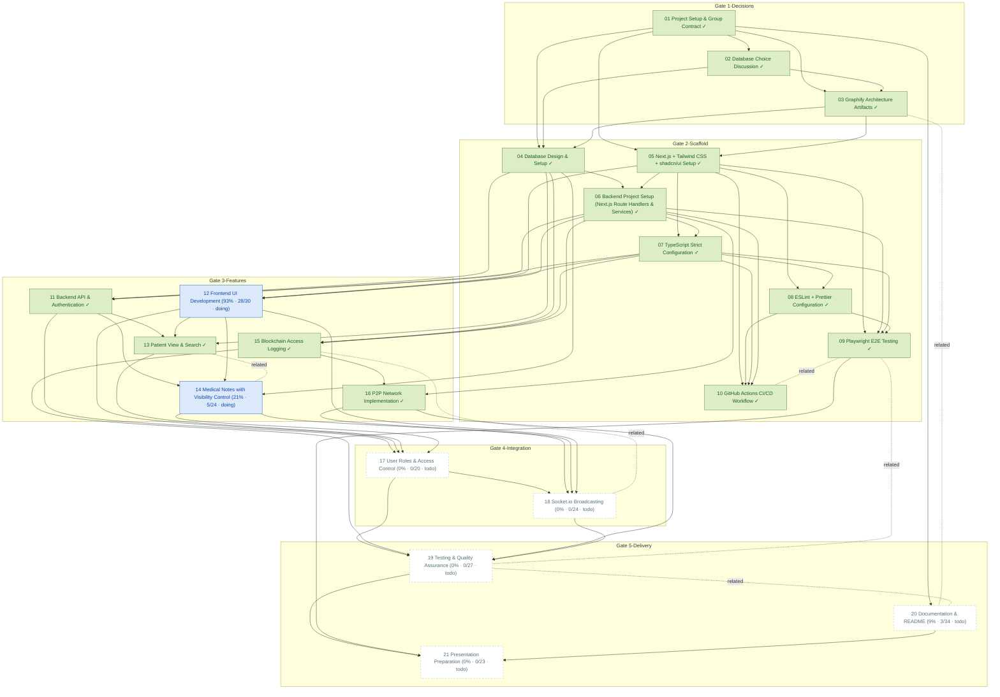

# Task Dependency Graph

_Auto-generated from the draft tasks in `docs/draft_tasks/`. Do not edit by hand._

Open in **[Mermaid Live](https://mermaid.live/edit#pako:eNqFV91O40YUfpWjIBCoBDL-SZxUqhQIyyLtrlLCtlJLL8b2OJnFeKKZMWm02qfobd-j932UPknPJLaTHFzKDfI35zu_3xyGr51EpaIz6mS5WiULri08TB4LwJ_jY5ipXKbAtVYrGEO3-wNcjeAKUrEURWpAFYiexrlKnkQK8RrGZw11oqxFMJeFcNQL0CLnDrnoOidj4EWKrrgW9UlDvVa50mYEcy1EAalCD3__BXFeCpAFLLXCA2MclnKzQJdzzddgVargtFAWjMUyRFrlYsoYz5cLzDqRRqrC_PrYucWAwLqTGnrs_La1fugxPO4xmGr1RSQWZsKWSziBW63w97UqrOYI__PnH3scz3E8mHDLY24EXC-UTARMpElK4wIQe9_Z--gT85IZ9k0nC2kxXIntGGsrM4xhDkjYcFKPSXiWqTyty_G6swrZixS4SMEus4kwcl5gPdu6DtMKnXEIn8Tv9uKLge_ggct8JXFQ17MZfpoFT5PispSt7L5j9-GKoxqQctjA09rpvSox1_c4_Vxos0lEv2CzzBlxN3DuBvCwXopZouUSPVkt0SHOIJPzUnP7urGRI0VwM_sgC4sZT7WwVgr9JmnoSEOY5ny90nK-sHDj3cCDMFYW80Nb1kNb1oNbad-XMYwT587A9d3l9QR-VvrJXaP_mVsmuJtzI0O_-65C9uI4FTLWNHM8vcNWjUu7EIWVSUsVzGmQefBOo0Qd5fMdDvtF5Gr5jBw4HfrH7sp40aXf29wdhdWd7TlwomQ-TNG5I_wkxWozHo7iJLGcqlgAH0WKueTwSVlhYCXtAllGxjKXdr29KyqHU49tIoeXXtAa2MmOhXDl9giuILzj4yRxN_yDms9fj8DpjPVh6k1RqXaFTYe752UuXJmvG_O6_6gMMd8KoR5B0L3bgXuhnAbZAD4bVNC9yoXTa5VbU11vU1zv0tt01W2h_dqcIFmEixTnaC-kgiut8BLxrbZ25OA1-XXmqcjli9DrOu0QF9gW2Yvo1MyGjXxP4MeSb-YxNgb1X-Be2oUdtOTsOY1jNROVlLuensD9zXjy8QaFtCH7l37QRnbC9dz6FKbh4seSV1dvF9t_o2Rcw5s_N7haKeA3S5cCtUVALRrAp0BNCalFAwQV0G-W5H8Bg2YRUqC2iJrdRoHaYkh9DCmlASIKVD5Yj1jsgAEF-hSoqmWMUhilMBrWoxSPUjwaxW-2HQU8AjSUgFICSgkoJaSJhTSxsNlEFdCnFn0adkDDNoBPgYACdR4RtWiAPgU8CtQ-hjT1IfXRABEBavF7vWZ1VEAzWwrgViAWPnna7bw58uERe-NouNc-chTslUiOor3M29NIcm7MRGTbZ2Qm83x0lCYiTaJzg_v7SYyOwjCKvew8ca_O0RGLQ9FCdqu0YsdimMUNm4X9MOnV7F4aDDgj7M3LdEvONj8NOe7FIglrchj0xYBXh133tsWXN1-PQgj2PG4G56r5_hD02kC_DQzawLAN7LeBgzYwagOHLSA-nlrAtoqYt-07QdtKYkGraVtNrK0mvE5uSASM2sBhC4jXogVkNdg578y1TDsjq0tx3nkW-pm7z87Xb3i05MUvSj3Xp_hvxnzRGWU8N_hVLlOU9ERyfABUJt_-BSvs9Z0)** (pako/zlib-compressed, verified to round-trip).

Regenerate whenever task metadata changes:

```bash
python3 -m project_management plan graph --output docs/diagrams/task-dependencies.md
```

## Legend

| Symbol | Meaning |
|---|---|
| `A --> B` (solid arrow) | B depends on A — B is **blocked by** A |
| `A -. related .- B` (dotted line) | A and B are **related** (soft link, not a dependency) |
| 🟢 green node | task **done** (marked ✓) |
| 🔵 blue node | **in progress** |
| ⬜ dashed-gray node | **todo** — not started |
| `(50% · 3/6 · doing)` | checkbox progress: 3 of 6 task boxes ticked, then the status |
| `(0/0 · todo)` | no checkboxes written yet — the checklist itself is still to be made |

Nodes are grouped into **Gate** subgraphs when tagged (`gate:1-decisions` …
`gate:5-delivery`). Tick `- [x]` boxes in the draft task files as the work
happens, then regenerate this diagram to update the percentages.


