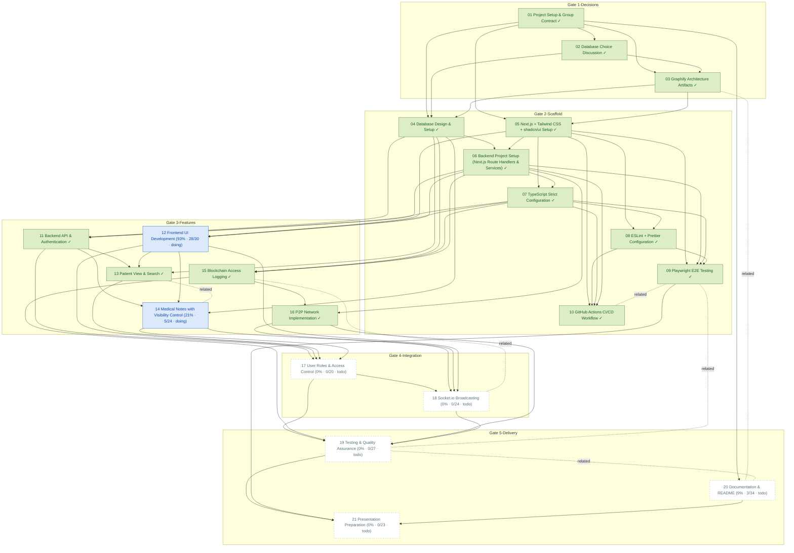

# Task Dependency Graph

_Auto-generated from the draft tasks in `docs/draft_tasks/`. Do not edit by hand._

Open in **[Mermaid Live](https://mermaid.live/edit#pako:eJx9Vs2O2zYQvvcpBgqy2CDxLklJtrQFCnjXm80CSeDGTnoQeqCosc2sKhokFdfP0Wvfo_c-Sp-kkCzKa1qJb983880fqTFXpdqJDdcWlrOfAABevoSFKmUBXGu1gymMRr_A7Q3cQoFbrAoDqoIpXOalEk9YQL6H6SunnClrsYBSVtgor0BjyRvmatTEmAKvCrgFrtFZnPJOlUqbG1hrxAoKVSH8-w_kZY0gK9hqtdZoTMMV3GywgLXme7CqUHBZKQvGcm2xOFRi6nyt-XYDBQpppKpMFjxwi0BHM8cEv7euS0KzgFCYa_UVhYUF2noLF_CgVb2FO1VZzYWF__7-qxewLCAMZtzynBuEu42SAmEmjahNE_rEOcwCEsJDU41c7WGqxUZaFLbWCFNt5YoLa54psCpOWzCCr1aqLLoO2GjREX2KKAtIdKxnhkauK7joWnleTJwFJIaP-Ke9-mrgNSy5LHeyKuBusYDXYDa8ENV1LQek4ywgY7jl4gmrwpvWpYv4SdUW4R2vihK1aUvQ36RA8-ok1iQLyASW-y0uhJZbCwurpbDNtFdyXWtu_SkmWUASuF-8l5WF1zDXaK1E_QNFmgUkhXnJ9zst1xsL9-welmisrNbPHSnJAkrgQdp3dQ5T0QQycPd4fTeD35R-WpVq96PjWSFvztJdsHD0tiP6BDQLKO0nN50_wgVMa7vBykpxVjhlWUAZvNWqso3_50eY4Tcs1fYPrCxcpuHL5iNgyXVI2q9ByWr9qleHWUBDmHMrG-8vEnftKXAtNidZoiygEXzAQgpewkdl0cBO2g18kUbmspR2f7j8qoRLRtuc8TWLBlLGWUBjuG3WgdhwWcFUiOZTfa_Wa3_Y4yygY5izOXxEu1P6CR7_2JbYtOZP4mzSsrK4Ppx0N-xo9Hjk-hyTLKAT-GxQwydVYnMNu4r6hkjbD7lm7QibJXJsJ8kCmsCiWW72Siq41YoXgh8uzlEZ-cqzegss5TfU-67YeDTriD5VmgU07S_lBfxa83bwU2NqzSuBz_JNziplJAsYgZkS9XF-F_Dpfjr7cA-XaasMr8OzSpeMZgFrVh6aXjjXuOXdd3TMGn6vyyWh7R_DkjAPh25LetjZI8_ucOhh5x97doejDo_dbvsOnrgF5mFnT9xS8rCzp54-9fwdTjzc6Sk5tfd44uGxh7v-KPX8qedPvXzM82eeP_Pih25NeZid4t4_8vwjzz_y_GOvntirJ3ZrpMNjzz728k28fA6HHo487PInnt3hsYeZh50-9epNPb3DySl295kR9_F32J2fhxnx7KH3nOojNcpTC_2-JT1Oy7NEx748S3KseLACUXJjZrg6vNpWsixvXhQCC5G8MVarJ7x5EcdJzlZvRPPIu3lB8xjPtc0O7MQ5pqu8F9N4HAvixKSIJpyeittn4EG7an-9Nic5ithp42iME94ZR81DkmvN9zcxRMeA7Vk1rfx8wrEBLhzgogEuHuDGA9xkgEsGuPSco2SAG-iDssOoT8mBRmg05DjQCR3ohE7aMznlkgEuPecYGeBox_0PINFq-Q)** (pako/zlib-compressed, verified to round-trip).

Regenerate whenever task metadata changes:

```bash
python3 -m project_management plan graph --output docs/diagrams/task-dependencies.md
```

## Legend

| Symbol | Meaning |
|---|---|
| `A --> B` (solid arrow) | B depends on A — B is **blocked by** A |
| `A -. related .- B` (dotted line) | A and B are **related** (soft link, not a dependency) |
| 🟢 green node | task **done** (marked ✓) |
| 🔵 blue node | **in progress** |
| ⬜ dashed-gray node | **todo** — not started |
| `(50% · 3/6 · doing)` | checkbox progress: 3 of 6 task boxes ticked, then the status |
| `(0/0 · todo)` | no checkboxes written yet — the checklist itself is still to be made |

Nodes are grouped into **Gate** subgraphs when tagged (`gate:1-decisions` …
`gate:5-delivery`). Tick `- [x]` boxes in the draft task files as the work
happens, then regenerate this diagram to update the percentages.


