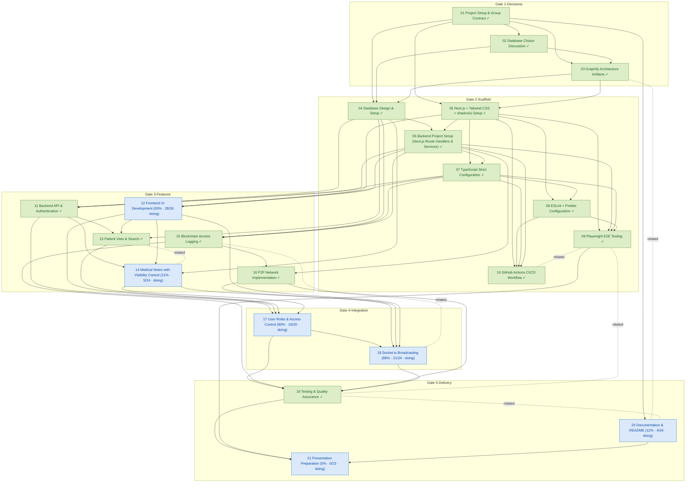

# Task Dependency Graph

_Auto-generated from the draft tasks in `docs/draft_tasks/`. Do not edit by hand._

Open in **[Mermaid Live](https://mermaid.live/edit#pako:eNqFV91u2zYUfpUDFykcLI5FSrJlDxjgxGkboC28ON2ArbugJMpmo4gGSdUzij7Fbvceu9-j7El2aEuKzXCdbwJ_PN_5_XjMfOllMue9aa8o5TZbM2Xgfv6xAvycncFSliIHppTcwgwGgx_gagpXkPMNr3INskK0n5Yye-A5pDuYnXfUuTQGwVJU3FIvQfGSWeRyYJ3MgFU5umKKtycd9VqWUukprBTnFeQSPfz9F6RlzUFUsFESD7S2WM70Gl2uFNuBkbmEfiUNaINl8LzJRdcpnm_WmHUmtJCV_vVj7zUGBDKYt9DH3m8H6_uA4HFAYKHkJ54ZWHJTb-AlvFYS_17LyiiG8D9__nHEoZZDYc4MS5nmcL2WIuMwFzqrtQ3g2IfWPkSfmJcosG8qWwuD4Wpsx0wZUWAMfULChjv16IwVhSzzthw6WDbIUaTIRoqeMptzLVYV1nOo6zSt2BrH8J7_bi4_afgO7pkotwIHdb1c4le9ZnlWDWvhZY8sewRXDNWAlNMG9lund7LGXN_g9Euu9D4R9Rmbpc8dd2Prbgz3uw1fZkps0JNRAh3iDAqxqhUzzxubWFICN8u3ojKY8UJxYwRX3yRNLGkCi5Lttkqs1gZu6A3cc21EtTq1JQHakgBeC_OmTmGWWXcarm-H13P4WaoHe43-Z24FZ3bOnQzDwasGOYpjVUhI18zZ4hZbNavNmldGZJ4qiNUgofBKoUQt5cMtDvszL-XmETnQn4Rn9srQZBgG-7sjsbrzIwdWlCSEBTq3hJ8E3-7Hw1CcTiyrKhLBO55jLiW8l4Zr2AqzRpYWqSiF2R3uiiyhT8k-cjykkTewlR2J4cruEVxBeMdnWWZv-Fu5Wj0fgdUZGcGCLlCpZotNh9vHTcltmc8b87z_qAy-OgihHUE0uH0Cj0JZDZIxfNCooDtZcqvXJreuuiTYV0dGQ-rvq9UkSXCX4ijNpZBwpSTeI3aQVz9JDnMh_vY8zz_npfjM1a5NPsY1dkCOglpNk0kn4pfwY832U5lpjbegwu100lVqhY0FzGVWPzXyJdzdzObvbqBP6D7LaBh6Z0itXqndmlx3bPyyYc2N6x-6FAxp-K0icf3uf2ZwpbpA2C1bF2gtIteiA0IXaCmxa9EBUQOMuuX4X8C4W4Au0Fok3U5zgdZi4vqYuJQOSFyg8UECx-IJGLvAyAWaaglxKcSlEDcsdSnUpVA3SthtORegDtBRIpcSuZTIpcRuYrGbWNxtoAYYuRYjN-zYDdsBoQtELtDmkbgWHTByAeoCrY-Jm_rE9dEBiQO04qdBtywaoJutC-BicCxC50n35M2ST4_IN44mR-1zjqKjEp2j5ChzfxpZybSe8-LwfCxEWU5f5BnPs-RC495-4NMXcZyktLjI7Gtz-oKkMfeQ7fJs2CmfFGnHJvEozoKWHeTRmBGHvX-RHsjF_tOR0yDlWdyS42jEx6w5HNg3Lb642W4aQ3TkcT84W833pyD1gaEPjHxg7ANHPnDsAxMfOPGA-GjygL6KCD303UF9JZHIa-qrifhqImMvP_Givqpo4DOlpEN7F72VEnlvalTNL3qPXD0y-7X35SsebVj1i5SP7Sn-i7Fa96YFKzV-qzc5ynouGP7sNyZf_wVUB_Tt)** (pako/zlib-compressed, verified to round-trip).

Regenerate whenever task metadata changes:

```bash
python3 -m project_management plan graph --output docs/diagrams/task-dependencies.md
```

## Legend

| Symbol | Meaning |
|---|---|
| `A --> B` (solid arrow) | B depends on A — B is **blocked by** A |
| `A -. related .- B` (dotted line) | A and B are **related** (soft link, not a dependency) |
| 🟢 green node | task **done** (marked ✓) |
| 🔵 blue node | **in progress** |
| ⬜ dashed-gray node | **todo** — not started |
| `(50% · 3/6 · doing)` | checkbox progress: 3 of 6 task boxes ticked, then the status |
| `(0/0 · todo)` | no checkboxes written yet — the checklist itself is still to be made |

Nodes are grouped into **Gate** subgraphs when tagged (`gate:1-decisions` …
`gate:5-delivery`). Tick `- [x]` boxes in the draft task files as the work
happens, then regenerate this diagram to update the percentages.


```mermaid
flowchart TD
    %% Solid arrow A --> B: B depends on A (blocked by A)
    %% Dotted line A -. related .- B: A and B are related
    %% Colors: green done · blue in progress · dashed gray todo (not started)
    subgraph decisions["Gate 1-Decisions"]
    T01["01 Project Setup & Group Contract ✓"]
    T02["02 Database Choice Discussion ✓"]
    T03["03 Graphify Architecture Artifacts ✓"]
    end
    subgraph scaffold["Gate 2-Scaffold"]
    T04["04 Database Design & Setup ✓"]
    T05["05 Next.js + Tailwind CSS + shadcn/ui Setup ✓"]
    T06["06 Backend Project Setup (Next.js Route Handlers & Services) ✓"]
    T07["07 TypeScript Strict Configuration ✓"]
    T08["08 ESLint + Prettier Configuration ✓"]
    T09["09 Playwright E2E Testing ✓"]
    T10["10 GitHub Actions CI/CD Workflow ✓"]
    end
    subgraph features["Gate 3-Features"]
    T11["11 Backend API & Authentication ✓"]
    T12["12 Frontend UI Development (93% · 28/30 · doing)"]
    T13["13 Patient View & Search ✓"]
    T14["14 Medical Notes with Visibility Control (21% · 5/24 · doing)"]
    T15["15 Blockchain Access Logging ✓"]
    T16["16 P2P Network Implementation ✓"]
    end
    subgraph integration["Gate 4-Integration"]
    T17["17 User Roles & Access Control (80% · 16/20 · doing)"]
    T18["18 Socket.io Broadcasting (88% · 21/24 · doing)"]
    end
    subgraph delivery["Gate 5-Delivery"]
    T19["19 Testing & Quality Assurance ✓"]
    T20["20 Documentation & README (12% · 4/34 · doing)"]
    T21["21 Presentation Preparation (0% · 0/23 · doing)"]
    end
    T01 --> T02
    T01 --> T03
    T02 --> T03
    T01 --> T04
    T02 --> T04
    T03 --> T04
    T01 --> T05
    T03 --> T05
    T04 --> T06
    T05 --> T06
    T05 --> T07
    T06 --> T07
    T05 --> T08
    T07 --> T08
    T05 --> T09
    T06 --> T09
    T07 --> T09
    T08 --> T09
    T05 --> T10
    T08 --> T10
    T07 --> T10
    T06 --> T10
    T04 --> T11
    T07 --> T11
    T06 --> T11
    T05 --> T12
    T07 --> T12
    T06 --> T12
    T04 --> T13
    T11 --> T13
    T12 --> T13
    T04 --> T14
    T11 --> T14
    T12 --> T14
    T04 --> T15
    T07 --> T15
    T06 --> T15
    T15 --> T16
    T06 --> T16
    T11 --> T17
    T12 --> T17
    T13 --> T17
    T14 --> T17
    T17 --> T18
    T14 --> T18
    T16 --> T18
    T12 --> T18
    T17 --> T19
    T15 --> T19
    T16 --> T19
    T18 --> T19
    T01 --> T20
    T19 --> T21
    T09 --> T21
    T20 --> T21
    T03 -. related .- T20
    T09 -. related .- T10
    T09 -. related .- T19
    T13 -. related .- T14
    T15 -. related .- T18
    T19 -. related .- T20
    classDef done fill:#dcedc8,stroke:#558b2f,color:#1b5e20
    classDef doing fill:#dbe9fb,stroke:#1565c0,color:#0d47a1
    classDef todo fill:#ffffff,stroke:#b0bec5,color:#546e7a,stroke-dasharray:5 4
    class T01 done;
    class T02 done;
    class T03 done;
    class T04 done;
    class T05 done;
    class T06 done;
    class T07 done;
    class T08 done;
    class T09 done;
    class T10 done;
    class T11 done;
    class T12 doing;
    class T13 done;
    class T14 doing;
    class T15 done;
    class T16 done;
    class T17 doing;
    class T18 doing;
    class T19 done;
    class T20 doing;
    class T21 doing;
```
