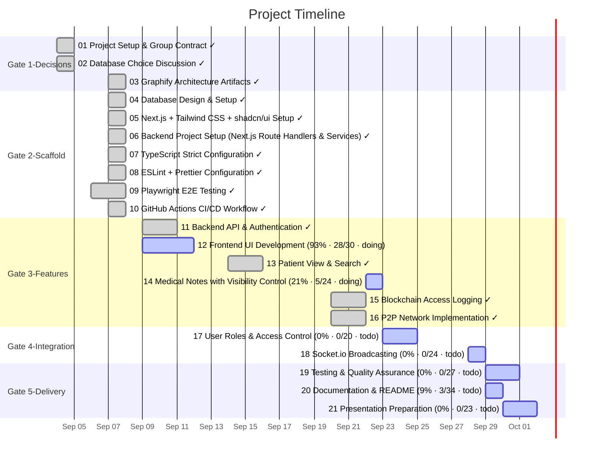

# Task Timeline (Gantt)

_Auto-generated from the draft tasks in `docs/draft_tasks/`. Do not edit by hand._

Open in **[Mermaid Live](https://mermaid.live/edit#pako:eJyVlE1u20gQhfc5xdtYcGAz4o_8o-xkUXYExIbGcjLwst0siRXR3UJ30YrOke3cY_Y5Sk4yIKmITiDLk53AQn316r1qzZUReQMAwlIQJs5-IS2440cq2FBdypTQpXWPSoD7-_v74Po6SNO6pL6y_1k6eMBB9qb-7EkLW4MrJYQoSEmzZ2t8XQyj7ZgpSblEB1fOlksMrRGntODHP9_wHpk1dIw4jE-DsB-EvWNEWQOIkSpRD8oThrllTUjZ69JXM15tTnDl1DLn2RoDp3MW0lI6wsAJz5QWv5twtiX8slwcTLWazWyxofdaaSl5nht0Nlu-Qg1PcENf5d0XjyPcKS5WbDIMp1Mcwecq06Zb8v9EneJC6QWZ7DejD39OuLWlED4okxXkfC3RPbEm__ZV9hnu1kuaasdLwVQca6mCm_G8dEpeDOAZ4Ryj6Uc2giNMHIkwuT8k9DEp1HrleJ4LRvEId-SFzXx34-kx4qYxCnHF8qF8wKCO0GM47g5T_G3dYlbY1R8lnwSXpKrLaa46iramDyZjdDAoJScjrPfs1G-lxbh01kjV_2mMlJ6osMtHMoLDfnKA7_8iPu8mYfUjs2zmb_EeSgs__cZLNrwEEyVc9X9mWtURK6fznTqiXqujh2vKWKsCN1bIY8WS4zN7fuCCZd08UlvgMI5qVSfduLdXVBxv_YtOcFFYvdC5YoOB1uQ9Ptr5_KXs4rAVdopJPMENycq6BcaPy4Iqe15291nzL8H1grERmje31rDP8MmTw60tqHoNG2XbVcN607Ab1_aLzezORZNW7DmmVi9I3rHFhbMq06q50JbV28s63310J0FKBT-RWzdz-tvT7-CvUtUJDbwvnTKang072zusPcM4RGp12Rrbwe1okF6PcNivWUk32S-8vxUeV__z5LeoiaOl2rzwVlmyj5Y0Ef4HiX37tw)** (pako/zlib-compressed, verified to round-trip).

Regenerate whenever task metadata changes:

```bash
python3 -m project_management plan gantt --output docs/diagrams/task-gantt.md
```

## Legend

| Bar | Meaning |
|---|---|
| `✓` task | **done** — rendered in the mermaid `done` style |
| plain task | **active** — scheduled work (or in progress) |
| `(50% · 3/6 · doing)` | checkbox progress + status, same format as the dependency graph |

Same design as the dependency graph: every task ends on its deadline (or on the
earliest deadline of the tasks that depend on it); duration comes from the
Estimated Effort. Tasks are grouped into Gate sections. Tasks with no usable
date cannot be drawn as a bar — they are listed under the chart until they get
a **Deadline**. (Mermaid gantt has no 'skipped' row state.)


