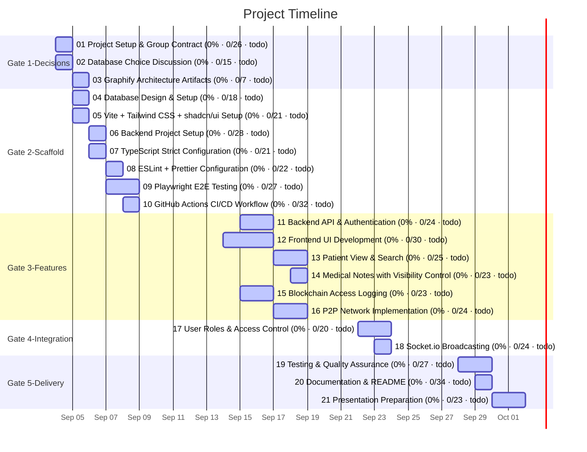

# Task Timeline (Gantt)

_Auto-generated from the draft tasks in `docs/draft_tasks/`. Do not edit by hand._

Regenerate whenever task metadata changes:

```bash
python3 -m project_management plan gantt --output docs/diagrams/task-gantt.md
```

## Legend

| Bar | Meaning |
|---|---|
| `✓` task | **done** — rendered in the mermaid `done` style |
| plain task | **active** — scheduled work (or in progress) |
| `(50% · 3/6 · doing)` | checkbox progress + status, same format as the dependency graph |

Same design as the dependency graph: every task ends on its deadline (or on the
earliest deadline of the tasks that depend on it); duration comes from the
Estimated Effort. Tasks are grouped into Gate sections. Tasks with no usable
date cannot be drawn as a bar — they are listed under the chart until they get
a **Deadline**. (Mermaid gantt has no 'skipped' row state.)


