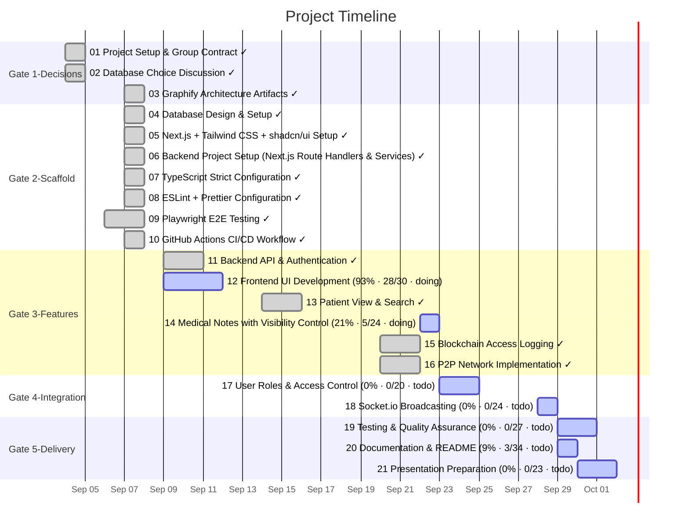

# Task Timeline (Gantt)

_Auto-generated from the draft tasks in `docs/draft_tasks/`. Do not edit by hand._

Open in **[Mermaid Live](https://mermaid.live/edit#pako:eNqVldtO20AQhl9lZAkEKiE-BEi4C3GASASlJLRqxc1ib-wBZ9faXRMixFP0tu_R-z5Kn6TjQw5USSi-iTfj_eaf0-6LFciQW6dWxIQxdwLoMWgSDgMlH3hgYIQTnqDgpS1khp9LNWEG4Bs9tX6_5vuljT2jntt27mEnvBOlQRMHpYAL2gxOzecBalrr0mo7C19DbrIUduFCSfrtSGEUo7___PwBpxBKwQ_Atd3jmt2q2Y0DcMKK4ILPDLtnmkMnlhhw8FEHmc69vL_bI38sjXE8g7YKYjQkJVOcFgbH5F-vR5wsEW8CdGvDgI3HMpnzG0t1PtcYCYqwjPQ9rn0E1_zZHD5o-AQjhskURQid4ZCWOmZhIOoZ_i_rGM5Y8MgJ8Dbde3MXNzIj-ZdMhAlXuhCpniiZev99-AmMZikfBgpT4hqFhKf6jTHKFDMby7CKaEJ3eIXCUGwDxY1Brj6KaMEgYbOpwig20HW7MOLaoIjW7zym92qnY8MFmsvsHtpFJTV0evWOD1-lehwncvqxDvBq55zlLVR1uOMsUt8e9Cix7czEXBgMtsTVWlHnwrmiYcgBtz1qoieeyHRCBNhreTvw-xe4zbpn5y-hpHj3CUeNi0__AL050IMBuc4BX5BPi1Izav21SpzGipIG9HlIuhO4loZrmKKJiaHxHhM0s3JmZQJ7rlPoOqq7ja2yXHeZROcIzhIZPAYxQ0GVoNbTcCWjaFMJXXtF2jEM3AHNi5lS0aA3SROep2hzild3v6lfo9ajZEdl11X0E7jV1JA3MuH5aFTiFuHaRbR23S2KYGQo1wbrrehtwpBi5eYQJZwpSdPMymZdwhpbYc0N7XdEJ2xCn6pZ5am1mINd-JyxolBtrWmsBB2VS3cnW92tNCRF6csgW6Z3F266bb_fpX4sYF7da7wHm2t38_Of6wWLFimrJn6pzduG86pKWgdWpDC0To3K-IE14XQZ5Uvr5ZVMKRPfpZzMrXTHRLF1OmaJplWW5lebj4zKXn3y-heaYDD6)** (pako/zlib-compressed, verified to round-trip).

Regenerate whenever task metadata changes:

```bash
python3 -m project_management plan gantt --output docs/diagrams/task-gantt.md
```

## Legend

| Bar | Meaning |
|---|---|
| `✓` task | **done** — rendered in the mermaid `done` style |
| plain task | **active** — scheduled work (or in progress) |
| `(50% · 3/6 · doing)` | checkbox progress + status, same format as the dependency graph |

Same design as the dependency graph: every task ends on its deadline (or on the
earliest deadline of the tasks that depend on it); duration comes from the
Estimated Effort. Tasks are grouped into Gate sections. Tasks with no usable
date cannot be drawn as a bar — they are listed under the chart until they get
a **Deadline**. (Mermaid gantt has no 'skipped' row state.)


