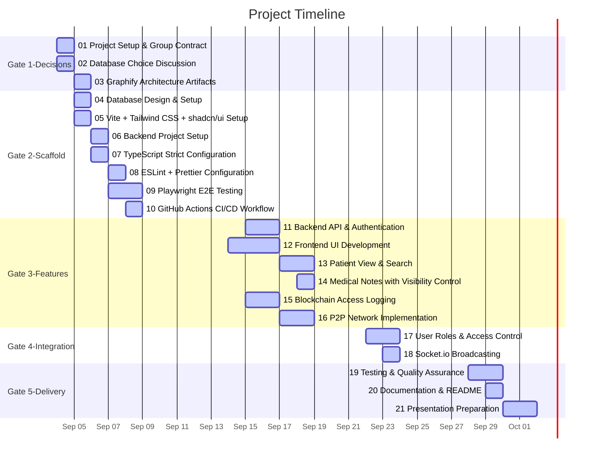

# Task Timeline (Gantt)

_Auto-generated from the draft tasks in `docs/draft_tasks/`. Do not edit by hand._

Regenerate whenever task metadata changes:

```bash
python3 -m project_management plan gantt --output docs/diagrams/task-gantt.md
```


