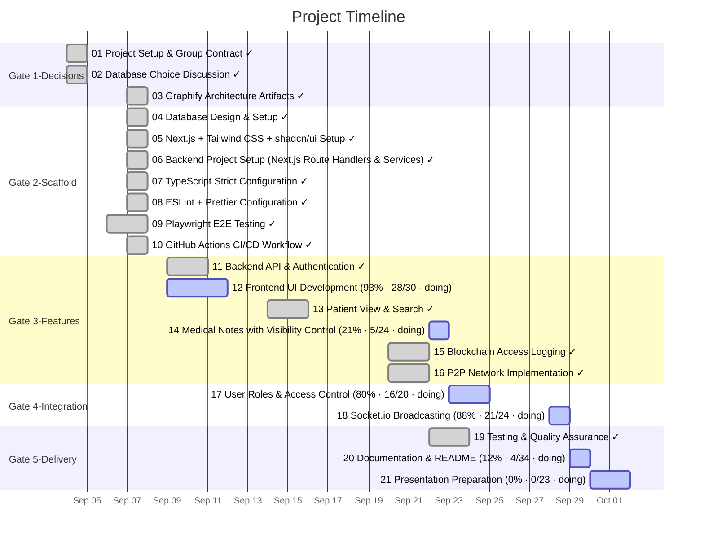

# Task Timeline (Gantt)

_Auto-generated from the draft tasks in `docs/draft_tasks/`. Do not edit by hand._

Open in **[Mermaid Live](https://mermaid.live/edit#pako:eNqVVdtO20AQ_ZWRJVBQCbHXISS8hThAJEApgVateFnsjT3g7Fq7a0KE-Iq-9j_63k_pl3QcOxcqIMUv8Wa8Z86cM7P75IQqEs6hE3Np7Y0EeizaVMBQqzsRWrjCiUhRijIWcSuOlZ5wC_CNnvr5eT0Iyhh_RLOIbd3CVnQjy4AhHFQSTmgzePVAhGhobcqo6y1zjYTNM9iGE63ot6ek1Zz-_vPzBxxCpKTYBeayVt3t1N3mLnhRhcAg4JbfciOglygMBQRowtwUWTbv9ikfzxIcz6CrwwQtUcm1oIXFMeU3r0McrCBeFMjqo5CPxypd4DdX7AJhMJZUYVnpJlx3Hy7Eo927M_AJrjimU5QR9EYjWpqER6Fs5Pi_WC044uG9IICXctcWKS5VTvRPuYxSoc2cpH4gMc3OZvADuJplYhRqzAjXaiR48m-Mca65fdOGdYg29EdnKC3VNtTCWhT6oxAdGKZ8NtUYJxb6rA9XwliU8es7W_Re7fRcOEF7mt9Cd-6kgd6g0Qvgq9L341RNP9YBfv1Y8KKFqg73vKX03eGAhO3mNhHSYvhOXZ01dgyONQ1DAXA9oCZ6EKnKJoQAtY6_Bb9_AWs3fLd4iRTVu0Nw1Lj48A-gvwD0YUipC4AvKKZzqzm1_qtMvOYakyaci4h4p3ChrDAwRZsQhsFbTNHOyplVKdSYN-e132DNd2kxthLR24ejVIX3YcJRkhPUegbOVBy_ZSFz16i1YMiGNC92SqbBYJKlopDobYnXd7_wr1kfkNhx2XUV-gFcG2rIS5WKYjQqcsty2-68XK_VYO_bwPw1ym0YUbnC7qGCI61ooHnZr7V2u7TV26hf-40m3KdzNqVP9axK1llOwzZ8zvncrq4xNFySDsxXBWIrrlRWoMJ8peg2XPa7wXkfah6bc202_A1UOyuqrDj0hVmi0SLj1ZjXSi3dBvPfxfMr_5xdJ9YYOYdW52LXmQi6goql8_RMoYzL70pNFlG6WeLEORzz1NAqz4oLLUBOZlefPP8FwuwuEQ)** (pako/zlib-compressed, verified to round-trip).

Regenerate whenever task metadata changes:

```bash
python3 -m project_management plan gantt --output docs/diagrams/task-gantt.md
```

## Legend

| Bar | Meaning |
|---|---|
| `✓` task | **done** — rendered in the mermaid `done` style |
| plain task | **active** — scheduled work (or in progress) |
| `(50% · 3/6 · doing)` | checkbox progress + status, same format as the dependency graph |

Same design as the dependency graph: every task ends on its deadline (or on the
earliest deadline of the tasks that depend on it); duration comes from the
Estimated Effort. Tasks are grouped into Gate sections. Tasks with no usable
date cannot be drawn as a bar — they are listed under the chart until they get
a **Deadline**. (Mermaid gantt has no 'skipped' row state.)


```mermaid
gantt
    title Project Timeline
    dateFormat  YYYY-MM-DD
    axisFormat  %b %d

    section Gate 1-Decisions
    01 Project Setup & Group Contract ✓ : done, 2026-09-04, 1d
    02 Database Choice Discussion ✓ : done, 2026-09-04, 1d
    03 Graphify Architecture Artifacts ✓ : done, 2026-09-07, 1d
    section Gate 2-Scaffold
    04 Database Design & Setup ✓ : done, 2026-09-07, 1d
    05 Next.js + Tailwind CSS + shadcn/ui Setup ✓ : done, 2026-09-07, 1d
    06 Backend Project Setup (Next.js Route Handlers & Services) ✓ : done, 2026-09-07, 1d
    07 TypeScript Strict Configuration ✓ : done, 2026-09-07, 1d
    08 ESLint + Prettier Configuration ✓ : done, 2026-09-07, 1d
    09 Playwright E2E Testing ✓ : done, 2026-09-06, 2d
    10 GitHub Actions CI/CD Workflow ✓ : done, 2026-09-07, 1d
    section Gate 3-Features
    11 Backend API & Authentication ✓ : done, 2026-09-09, 2d
    12 Frontend UI Development (93% · 28/30 · doing) : active, 2026-09-09, 3d
    13 Patient View & Search ✓ : done, 2026-09-14, 2d
    14 Medical Notes with Visibility Control (21% · 5/24 · doing) : active, 2026-09-22, 1d
    15 Blockchain Access Logging ✓ : done, 2026-09-20, 2d
    16 P2P Network Implementation ✓ : done, 2026-09-20, 2d
    section Gate 4-Integration
    17 User Roles & Access Control (80% · 16/20 · doing) : active, 2026-09-23, 2d
    18 Socket.io Broadcasting (88% · 21/24 · doing) : active, 2026-09-28, 1d
    section Gate 5-Delivery
    19 Testing & Quality Assurance ✓ : done, 2026-09-22, 2d
    20 Documentation & README (12% · 4/34 · doing) : active, 2026-09-29, 1d
    21 Presentation Preparation (0% · 0/23 · doing) : active, 2026-09-30, 2d
```
