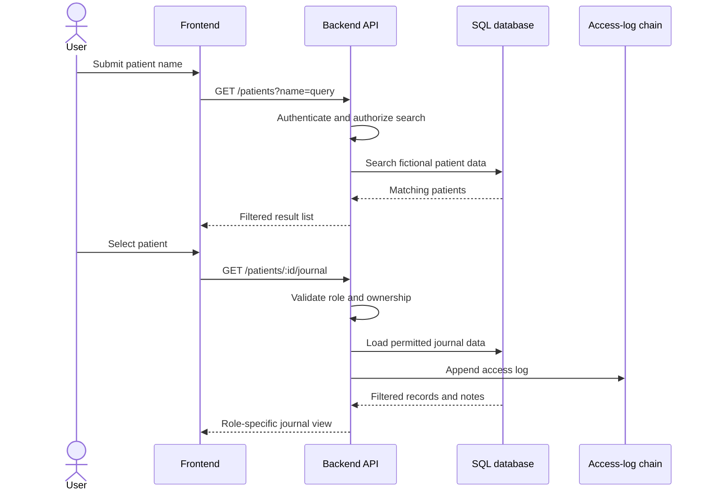

# Task: Patient View & Search

## Metadata
- **Priority:** P0 - Critical
- **Deadline:** 2026-09-18
- **Status:** TODO
- **Assignee:** TBD
- **Tags:** frontend, patient, search, required, gate:3-features, stream:B-patient
- **Dependencies:** 04-database-design.md, 11-backend-api-auth.md, 12-frontend-ui.md
- **Estimated Effort:** 6h

## Requirements

- Search functionality for patients by name
- Patient view varies based on logged-in role
- Patients can only see own data (no URL manipulation)
- Unauthorized users see "Access Denied"
- Search should be efficient and user-friendly

## User Stories

- As healthcare staff, I want to search patients by name so that I can find the correct journal quickly.
- As a patient, I want direct access to my own journal without a search flow so that another patient's ID cannot expose my data.
- As a user, I want the journal view to match my role so that forbidden actions and information are not shown.

## Test-First Checkpoint

- Write tests for an authorized name search, an empty result, and a patient being refused access to another patient's identifier.
- Assert both the backend response and the visible frontend state where the behavior crosses the API boundary.

## Design

### User Stories

- As healthcare staff, I want to search patients by name so that I can find the correct journal quickly.
- As a patient, I want to be routed directly to my own journal so that I do not need, and cannot use, a search flow for another patient.
- As a user, I want the patient view to reflect my role so that actions and data are understandable without exposing forbidden controls.

### Search-to-Journal Flow



### Search Interface

```
┌─────────────────────────────────────┐
│ Search Patients                     │
├─────────────────────────────────────┤
│ [________________________] [Search] │
│                                     │
│ Filters:                            │
│ ☑ Name  ☑ DOB  ☑ Personal Number   │
│                                     │
│ Results:                            │
│ ┌─────────────────────────────────┐ │
│ │ Anna Andersson                  │ │
│ │ DOB: 1985-03-15                 │ │
│ │ Records: 5 | Last visit: 2024-01│ │
│ └─────────────────────────────────┘ │
│                                     │
│ Pagination: [1] [2] [3] ... [10]   │
└─────────────────────────────────────┘
```

### Patient Detail View

#### Doctor View
```
┌─────────────────────────────────────┐
│ Patient: Anna Andersson             │
│ DOB: 1985-03-15 | ID: 12345        │
├─────────────────────────────────────┤
│ Tabs: [Records] [Notes] [Access]   │
├─────────────────────────────────────┤
│ Medical Records:                    │
│ ┌─────────────────────────────────┐ │
│ │ 2024-01-15: Annual checkup     │ │
│ │ Doctor: Dr. Svensson            │ │
│ │ [View Details]                  │ │
│ └─────────────────────────────────┘ │
│                                     │
│ [+ Add New Record]                  │
└─────────────────────────────────────┘
```

#### Patient View (Own Data)
```
┌─────────────────────────────────────┐
│ My Health Record                    │
├─────────────────────────────────────┤
│ Tabs: [My Records] [My Access Log] │
├─────────────────────────────────────┤
│ My Medical Records:                 │
│ ┌─────────────────────────────────┐ │
│ │ 2024-01-15: Annual checkup     │ │
│ │ [View Details]                  │ │
│ └─────────────────────────────────┘ │
│                                     │
│ Access Log:                         │
│ ┌─────────────────────────────────┐ │
│ │ 2024-01-15 10:30 - Dr. Svensson│ │
│ │ viewed your records             │ │
│ └─────────────────────────────────┘ │
└─────────────────────────────────────┘
```

### Search Algorithm

```javascript
// Backend search with fuzzy matching
async function searchPatients(query, filters) {
    const searchQuery = `
        SELECT * FROM patients 
        WHERE (
            LOWER(first_name) LIKE LOWER($1) OR
            LOWER(last_name) LIKE LOWER($1) OR
            personal_number LIKE $1
        )
        ORDER BY last_name, first_name
        LIMIT $2 OFFSET $3
    `;
    
    const results = await db.query(searchQuery, [
        `%${query}%`,
        limit,
        offset
    ]);
    
    return results;
}
```

## Tasks

- [ ] Create patient search component
- [ ] Implement search API endpoint with pagination
- [ ] Add search filters (name, DOB, personal number)
- [ ] Create patient detail view component
- [ ] Implement role-based view switching
- [ ] Add patient ownership validation
- [ ] Create "Access Denied" page
- [ ] Implement search result highlighting
- [ ] Add loading states for search
- [ ] Handle empty search results gracefully
- [ ] Add keyboard navigation for search

## Done Criteria

- [ ] Search returns correct results by name
- [ ] Pagination works correctly
- [ ] Filters narrow down search results
- [ ] Patient view adapts to user role
- [ ] Patients can only see own data
- [ ] URL manipulation is prevented
- [ ] "Access Denied" page shows for unauthorized
- [ ] Search is fast and responsive
- [ ] Empty states are handled properly
- [ ] Keyboard navigation works

## Notes

- Consider implementing debounced search for better UX
- Use React Router for patient detail navigation
- Make sure to sanitize search input to prevent SQL injection
- Consider adding recent searches feature
- Add keyboard shortcuts for power users

## Questions to Resolve

- [ ] How to handle Swedish characters in search? (å, ä, ö)
- [ ] Should we implement autocomplete for search?
- [ ] What's the optimal page size for search results?
- [ ] Should we cache search results?
