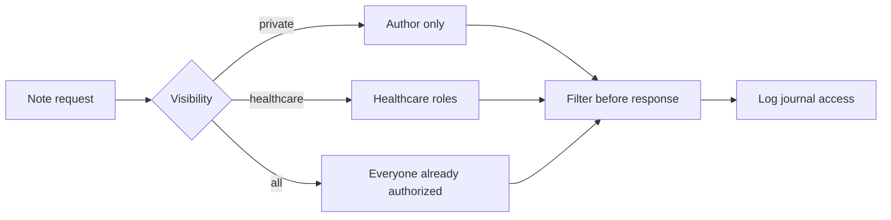

# Task: Medical Notes with Visibility Control

## Metadata
- **Priority:** P1 - High
- **Deadline:** 2026-09-18
- **Status:** TODO
- **Assignee:** TBD
- **Tags:** frontend, notes, visibility, required, gate:3-features, stream:C-notes
- **Dependencies:** 04-database-design.md, 11-backend-api-auth.md, 12-frontend-ui.md
- **Related:** 13-patient-view-search.md
- **Estimated Effort:** 5h

## Requirements

- Users can add notes to patient records
- Notes have 3 visibility levels:
  - Private: Only visible to author
  - Healthcare: Visible to doctors, nurses, ambulance
  - All: Visible to everyone with access (including patient)
- Notes are saved and displayed in patient view
- Access to notes is logged

React Query is an optional way to coordinate note queries and mutations. If used, request and response types should come from the generated `src/api/generated.ts` file, and the relevant cache should be invalidated or updated after successful writes. The backend still decides which note content is visible.

## User Stories

- As healthcare staff, I want to create a note with an explicit visibility level so that sensitive information reaches only the intended audience.
- As a patient, I want to see notes marked `all` and know that protected notes exist without reading their content.
- As the system, I want note creation and viewing to produce access evidence so that journal use can be audited.

## Test-First Checkpoint

- Write visibility tests before implementing note creation: private, healthcare-only, and all-users cases.
- Include the patient view assertion that protected note content is absent while permitted notes remain visible.

## Design

### User Stories

- As healthcare staff, I want to create a note with an explicit visibility level so that sensitive information reaches only the intended audience.
- As a patient, I want to see notes marked `all` and know that other notes exist without reading their protected content.
- As the system, I want note creation and viewing to produce access evidence so that later review can identify who accessed the journal.

### Visibility Decision Table



### Visibility Levels

```
Private (private):
├── Author can see
├── Other doctors cannot see
├── Nurses cannot see
├── Ambulance cannot see
├── Patient cannot see
└── Access is logged

Healthcare (healthcare):
├── Author can see
├── Other doctors can see
├── Nurses can see
├── Ambulance can see
├── Patient CANNOT see (but sees that a note exists)
└── Access is logged

All (all):
├── Author can see
├── Other doctors can see
├── Nurses can see
├── Ambulance can see
├── Patient CAN see
└── Access is logged
```

### Note Creation Interface

```
┌─────────────────────────────────────┐
│ Add Note to Patient: Anna Andersson │
├─────────────────────────────────────┤
│ Note Content:                       │
│ ┌─────────────────────────────────┐ │
│ │                                 │ │
│ │ Patient shows signs of...       │ │
│ │                                 │ │
│ │                                 │ │
│ └─────────────────────────────────┘ │
│                                     │
│ Visibility:                         │
│ ○ Private (only me)                 │
│ ● Healthcare (doctors, nurses)      │
│ ○ All (everyone with access)        │
│                                     │
│ [Cancel] [Save Note]                │
└─────────────────────────────────────┘
```

### Note Display

#### For Healthcare Staff
```
┌─────────────────────────────────────┐
│ Notes for Anna Andersson            │
├─────────────────────────────────────┤
│ ┌─────────────────────────────────┐ │
│ │ Note by Dr. Svensson (Private)  │ │
│ │ 2024-01-15 10:30                │ │
│ │ Patient shows signs of anxiety  │ │
│ │ [Edit] [Delete]                 │ │
│ └─────────────────────────────────┘ │
│                                     │
│ ┌─────────────────────────────────┐ │
│ │ Note by Nurse Karlsson (All)    │ │
│ │ 2024-01-15 14:20                │ │
│ │ Patient blood pressure normal   │ │
│ └─────────────────────────────────┘ │
│                                     │
│ [+ Add Note]                        │
└─────────────────────────────────────┘
```

### Optional Note Mutation Example

```tsx
const queryClient = useQueryClient();

const createNote = useMutation({
  mutationFn: (input: CreateNoteInput) => api.createNote(patientId, input),
  onSuccess: () => {
    queryClient.invalidateQueries({
      queryKey: ['patient-notes', patientId],
    });
  },
});
```

Show `isPending`, `isError`, and the server error message in the form. Do not infer hidden-note visibility only from cached client data.

#### For Patient
```
┌─────────────────────────────────────┐
│ My Notes                            │
├─────────────────────────────────────┤
│ ┌─────────────────────────────────┐ │
│ │ Note by Nurse Karlsson (All)    │ │
│ │ 2024-01-15 14:20                │ │
│ │ Patient blood pressure normal   │ │
│ └─────────────────────────────────┘ │
│                                     │
│ ℹ️ 2 notes exist but are private    │
└─────────────────────────────────────┘
```

## Tasks

- [ ] Create note creation form with visibility selector
- [ ] Implement note API endpoints (CRUD)
- [ ] Add visibility-based filtering in backend
- [ ] Create note display component
- [ ] Implement role-based note visibility
- [ ] Add note count indicator for hidden notes
- [ ] Log note access to blockchain
- [ ] Add note editing functionality
- [ ] Add note deletion with confirmation
- [ ] Handle edge cases (empty notes, long text)

## Done Criteria

- [ ] Notes can be created with 3 visibility levels
- [ ] Private notes only visible to author
- [ Healthcare notes visible to healthcare staff
- [ ] "All" notes visible to patients too
- [ ] Patients see count of hidden notes
- [ ] Note access is logged to blockchain
- [ ] Notes can be edited by author
- [ ] Notes can be deleted with confirmation
- [ ] UI clearly shows note visibility level
- [ ] All note operations are logged

## Notes

- Consider adding rich text editing for notes
- Make sure to handle markdown or formatting
- Add character limit for notes (e.g., 1000 chars)
- Consider adding timestamps and edit history
- Log all note operations for audit trail

## Questions to Resolve

- [ ] Should notes support rich text or plain text only?
- [ ] What's the character limit for notes?
- [ ] Should we show edit history for notes?
- [ ] How to handle note deletion (soft delete vs hard delete)?
