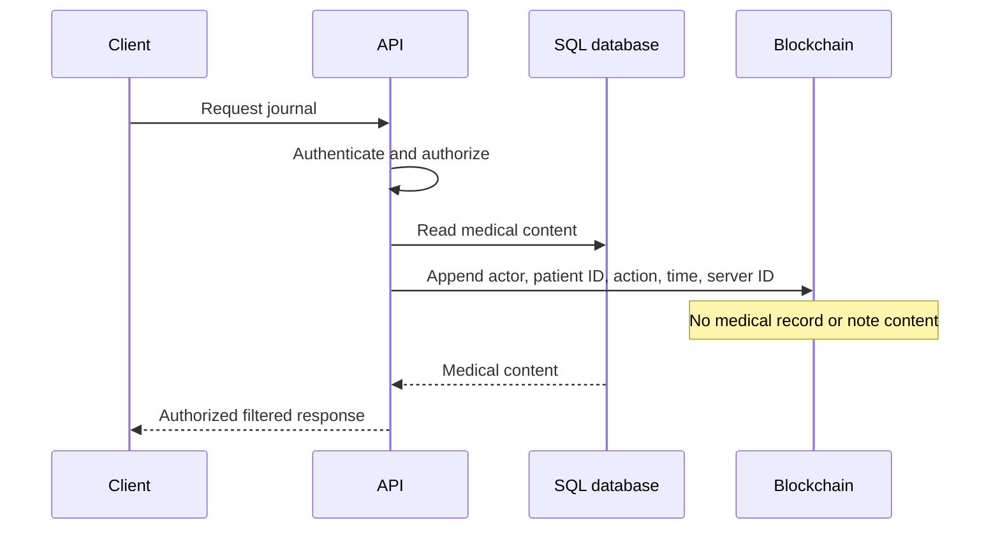

# Task: Blockchain Access Logging

## Metadata
- **Priority:** P0 - Critical
- **Deadline:** 2026-09-14
- **Status:** TODO
- **Assignee:** umoraghad0-del (huvudansvar, Stream D)
- **Tags:** blockchain, logging, gdpr, required, gate:3-features, stream:D-audit
- **Dependencies:** 04-database-design.md, 07-typescript-strict-config.md, 06-backend-project-setup.md
- **GitHub Issue:** #17 (https://github.com/matdevstamp/inl-3-awesome-journal/issues/17)
- **Related:** 18-socketio-broadcasting.md
- **Estimated Effort:** 8h

## Requirements

- Every time a user views patient data, generate access log to blockchain
- Medical records must NEVER be stored on blockchain (GDPR)
- Access logs must be immutable and verifiable
- Multiple servers must share access logs via P2P network
- Patients can view who accessed their records

## User Stories

### Access Logging
- **US-01:** As a system, I want to log every access to patient data so that there's an audit trail
- **US-02:** As a system, I want to store access logs on the blockchain so that they're immutable
- **US-03:** As a system, I want to NEVER store medical records on the blockchain so that we comply with GDPR

### Verification
- **US-04:** As a patient, I want to verify that access logs are on the blockchain so that I trust the system
- **US-05:** As a system, I want to detect tampering so that I can alert about security issues
- **US-06:** As an administrator, I want to verify blockchain integrity so that I can ensure system health

### Sync
- **US-07:** As a system, I want to sync access logs between servers so that all servers have the same data
- **US-08:** As a system, I want to handle network partitions gracefully so that the system remains available
- **US-09:** As a system, I want to recover from server downtime so that no data is lost

### Viewing
- **US-10:** As a patient, I want to view who accessed my records so that I can monitor my privacy
- **US-11:** As a healthcare provider, I want to view access logs so that I can see who else viewed the data
- **US-12:** As an administrator, I want to monitor blockchain status so that I can ensure system health

## Test-First Checkpoint

- Write a test proving a permitted journal read creates one verifiable access-log event.
- Write a privacy-boundary test proving medical record and note content never enters the blockchain payload.

## Design

### User Stories

- As a patient, I want every journal access recorded so that I can inspect who viewed my information.
- As the system, I want medical content excluded from blockchain payloads so that the privacy boundary is preserved.
- As an auditor, I want access-log entries to be verifiable and append-only so that deletion or alteration is detectable.

### Privacy Boundary and Logging Flow



### What Goes to Blockchain

```
✅ Access Logs:
├── Who accessed (user ID, role)
├── What was accessed (patient ID, record ID)
├── When (timestamp)
├── Action type (view, edit, create)
└── Server location (port)

❌ Never on Blockchain:
├── Medical records content
├── Patient personal information
├── Notes content
└── Any GDPR-sensitive data
```

### Blockchain Structure

```javascript
// Simple blockchain for access logs
class Block {
    constructor(index, timestamp, data, previousHash = '') {
        this.index = index;
        this.timestamp = timestamp;
        this.data = data;  // Access log data
        this.previousHash = previousHash;
        this.hash = this.calculateHash();
    }
    
    calculateHash() {
        return SHA256(
            this.index + 
            this.previousHash + 
            this.timestamp + 
            JSON.stringify(this.data)
        ).toString();
    }
}

// Access log data structure
const accessLogData = {
    userId: 123,
    userRole: 'doctor',
    patientId: 456,
    recordId: 789,
    action: 'view',
    timestamp: '2024-01-15T10:30:00Z',
    serverPort: 3001
};
```

### Blockchain Integration Flow

```
1. User requests patient data
2. Backend validates authentication & authorization
3. Data is retrieved from SQL database
4. Access log is created and stored locally
5. Access log is added to blockchain
6. Blockchain is broadcast to other servers
7. Response is sent to user
8. Access log is marked as synced
```

### Verification System

```javascript
// Verify blockchain integrity
function verifyBlockchain(chain) {
    for (let i = 1; i < chain.length; i++) {
        const currentBlock = chain[i];
        const previousBlock = chain[i - 1];
        
        // Verify hash
        if (currentBlock.hash !== currentBlock.calculateHash()) {
            return false;
        }
        
        // Verify chain linkage
        if (currentBlock.previousHash !== previousBlock.hash) {
            return false;
        }
    }
    return true;
}
```

## Tasks

- [ ] Implement basic blockchain class
- [ ] Create access log structure
- [ ] Integrate blockchain with access logging
- [ ] Add verification system
- [ ] Create API to query access logs
- [ ] Implement blockchain sync between servers
- [ ] Add tamper detection
- [ ] Create access log viewer for patients
- [ ] Log all access attempts (success and failure)
- [ ] Add blockchain status monitoring

## Done Criteria

- [ ] Access logs are stored in blockchain
- [ ] Blockchain is immutable and verifiable
- [ ] Medical records are NOT on blockchain
- [ ] Access logs sync between servers
- [ ] Patients can view who accessed their data
- [ ] Tampering is detected and reported
- [ ] All access attempts are logged
- [ ] Blockchain status can be monitored
- [ ] GDPR compliance is maintained

## Notes

- Keep the blockchain simple - focus on access logging
- Consider using a lightweight blockchain library
- Make sure to handle network partitions gracefully
- Log blockchain operations for debugging
- Consider adding blockchain export functionality

## Questions to Resolve

- [ ] Which blockchain library to use? (Consider crypto-js for simplicity)
- [ ] How to handle blockchain size growth?
- [ ] Should we implement mining/proof-of-work? (Probably not needed)
- [ ] How to handle server downtime and sync recovery?
