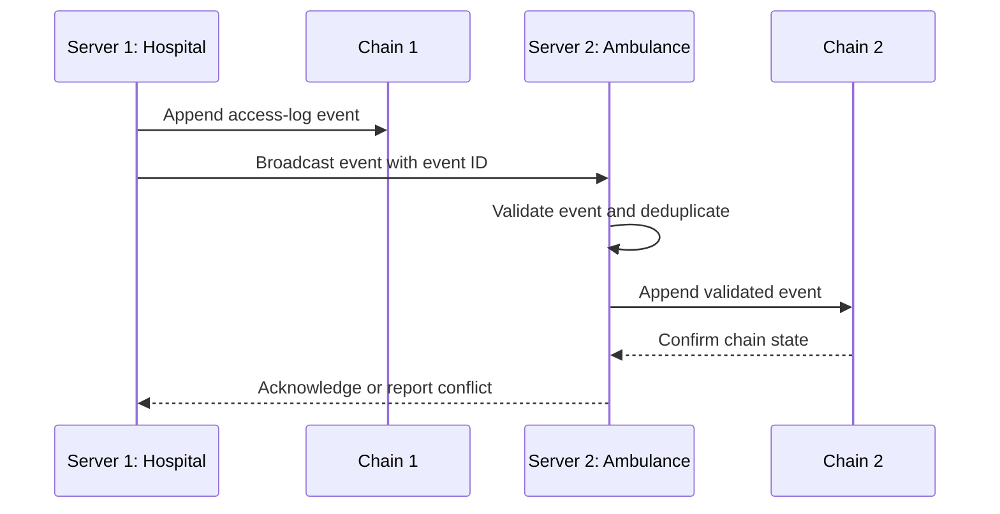

# Task: P2P Network Implementation

## Metadata
- **Priority:** P0 - Critical
- **Deadline:** 2026-09-16
- **Status:** In review
- **Assignee:** umoraghad0-del (pair-programmering)
- **Tags:** networking, p2p, distributed, required, gate:3-features, stream:D-audit
- **Dependencies:** 15-blockchain-access-logging.md, 06-backend-project-setup.md
- **GitHub Issue:** #18 (https://github.com/matdevstamp/inl-3-awesome-journal/issues/18)
- **Estimated Effort:** 6h

## Requirements

- At least 2 simultaneous servers running (e.g., port 3001 and 3002)
- Simulate different locations (e.g., Hospital S and Ambulance A)
- Servers must share access logs via blockchain

## User Stories

- As a hospital server, I want to share access-log events with the ambulance server so that both nodes have the same audit history.
- As a developer, I want stable server identities and ports so that distributed events can be traced during the demo.
- As an auditor, I want duplicate and conflicting events handled explicitly so that the chain remains verifiable.
- Real-time synchronization of data
- Handle network partitions gracefully

## Test-First Checkpoint

- Write a two-node test for event propagation, duplicate-event handling, and a rejected invalid event before implementing transport.
- Use stable fictional server identities and ports in the test configuration.

## Design

### User Stories

- As a hospital server, I want to share access-log events with the ambulance server so that both nodes have the same audit history.
- As a developer, I want each server to have a stable identity and port so that distributed events can be traced during the demo.
- As an auditor, I want conflicting or duplicate events handled explicitly so that the chain remains verifiable.

### Two-Server Event Flow



### Network Architecture

```
┌─────────────────┐              ┌─────────────────┐
│   Server 1      │              │   Server 2      │
│   Port 3001     │◄────────────►│   Port 3002     │
│   Hospital S    │   P2P Sync   │   Ambulance A   │
└────────┬────────┘              └────────┬────────┘
         │                                │
         ▼                                ▼
┌─────────────────┐              ┌─────────────────┐
│   Database 1    │              │   Database 2    │
│   (Local)       │              │   (Local)       │
└─────────────────┘              └─────────────────┘
         │                                │
         └───────────────┬────────────────┘
                         ▼
              ┌─────────────────┐
              │   Blockchain    │
              │   (Shared)      │
              └─────────────────┘
```

### P2P Communication Protocol

```javascript
// Message types for P2P communication
const MessageTypes = {
    BLOCKCHAIN_SYNC: 'blockchain_sync',
    ACCESS_LOG: 'access_log',
    DATA_REQUEST: 'data_request',
    DATA_RESPONSE: 'data_response',
    HEARTBEAT: 'heartbeat',
    PEER_LIST: 'peer_list'
};

// P2P Message structure
const p2pMessage = {
    type: MessageTypes.ACCESS_LOG,
    from: 'server_3001',
    timestamp: Date.now(),
    data: {
        // Access log data
    },
    signature: 'digital_signature'
};
```

### Server Discovery

```javascript
// Simple peer discovery
const peers = [
    { id: 'server_3001', url: 'http://localhost:3001' },
    { id: 'server_3002', url: 'http://localhost:3002' }
];

// Heartbeat to check peer availability
setInterval(() => {
    peers.forEach(peer => {
        checkPeerHealth(peer).catch(() => {
            console.log(`Peer ${peer.id} is offline`);
            // Handle peer disconnection
        });
    });
}, 5000);
```

### Data Synchronization

```
Sync Process:
1. Server 1 receives access request
2. Access is logged locally
3. Access log is added to local blockchain
4. Blockchain is broadcast to Server 2
5. Server 2 validates and adds to its blockchain
6. Both servers have identical access logs
7. Medical records stay in local databases
```

## Tasks

- [x] Set up multiple server instances
- [x] Implement P2P communication protocol
- [x] Create peer discovery mechanism
- [x] Implement heartbeat system
- [x] Add blockchain sync between servers
- [ ] Handle network partitions
- [x] Implement data consistency checks
- [x] Add peer health monitoring
- [ ] Create failover mechanism
- [x] Test with simultaneous access

## Done Criteria

- [x] 2+ servers run simultaneously
- [x] Servers can discover each other
- [x] Access logs sync between servers
- [x] Blockchain is consistent across servers
- [ ] Network partitions are handled gracefully
- [x] Heartbeat detects failed peers
- [x] Data consistency is maintained
- [x] Servers can recover from disconnection
- [x] Simultaneous access works correctly
- [ ] Performance is acceptable

## Notes

- Keep P2P implementation simple for this project
- Focus on access log sync, not full database replication
- Use WebSockets for real-time communication
- Consider using a P2P library like libp2p for production
- Log all P2P operations for debugging
- Core delivered in PR #33 (`feature/16-p2p-network`, **under review**): two-server Playwright setup (3001/3002), message protocol, peer discovery with dedup/validation, heartbeat + health checks, access-log sync + recovery, e2e tests. Remaining after review: P2P payload validation (MED), graceful partition handling, failover, perf validation.

## Questions to Resolve

- [ ] How to handle server startup order?
- [ ] What's the sync interval for blockchain?
- [ ] How to handle conflicting updates?
- [ ] Should we implement encryption for P2P messages?
