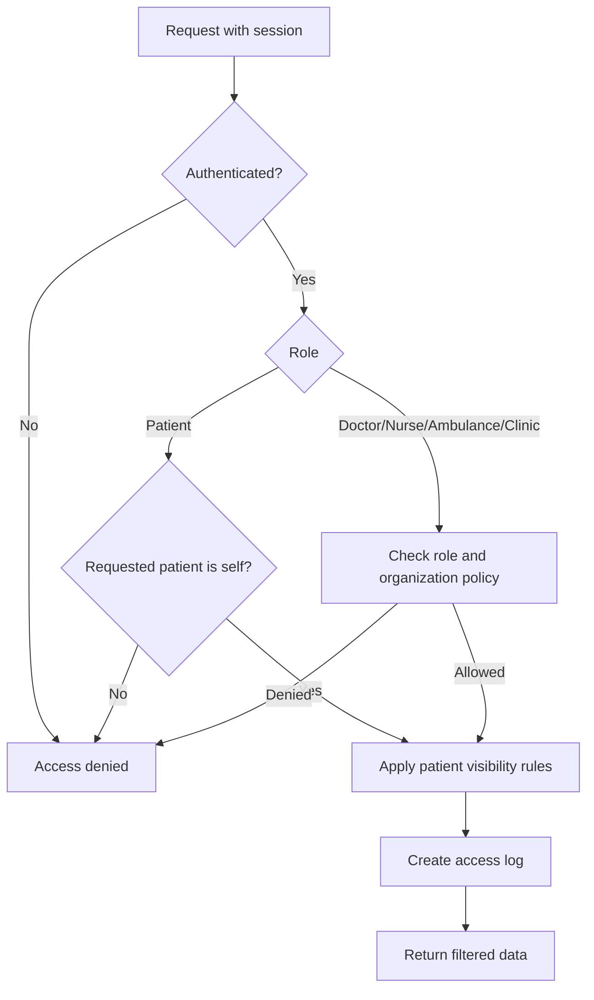

# Task: User Roles & Access Control

## Metadata
- **Priority:** P0 - Critical
- **Deadline:** 2026-09-18
- **Status:** DOING
- **Assignee:** rcilomba
- **Tags:** security, roles, access-control, required, gate:4-integration
- **Dependencies:** 11-backend-api-auth.md, 12-frontend-ui.md, 13-patient-view-search.md, 14-medical-notes.md
- **Estimated Effort:** 6h

## Requirements

- 5 distinct user roles with different permissions
- Patients cannot manipulate URLs to access other data
- Unauthorized users see "Access Denied" page
- Role-based UI that adapts to logged-in user
- Secure access control on both frontend and backend

## User Stories

- As a patient, I want the server to reject a tampered patient ID so that I can access only my own journal.
- As healthcare staff, I want permissions enforced by role and organization so that I see only authorized data.
- As an unauthorized user, I want a clear access-denied page so that no patient data is revealed.

## Test-First Checkpoint

- Write a permission matrix test for all five roles before implementing middleware or frontend guards.
- Include URL tampering and access-denied cases as mandatory regression tests.

## Design

### User Stories

- As a patient, I want the server to ignore a tampered patient ID in the URL so that I can only access my own journal.
- As a doctor, nurse, ambulance worker, or healthcare organization, I want permissions enforced by role and organization so that I see only data I am authorized to access.
- As an unauthorized user, I want a clear access-denied page so that no patient data is accidentally revealed.

### Authorization Decision Flow



### Role Definitions

#### 1. Doctor (Läkare)
- Full access to all patient records
- Can create/edit medical records
- Can create notes with any visibility
- Can view access logs for all patients
- Can search all patients

#### 2. Nurse/Ambulance (Sjuksköterska/Ambulanspersonal)
- Can view patient records
- Can create notes (private, healthcare, all)
- Can view access logs for patients they've accessed
- Can search patients
- Cannot create/edit medical records

#### 3. Healthcare Organization (Vårdcentral)
- Can view records for their organization's patients
- Can create notes (private, healthcare, all)
- Can view access logs for organization's patients
- Can search patients within organization

#### 4. Patient (Patienten)
- Can only view own records
- Can view own access logs
- Can see notes with visibility "all" only
- Cannot create notes
- Cannot search other patients
- Cannot manipulate URLs to access other data

#### 5. Unauthorized (Obehörig)
- Sees "Access Denied" page only
- No access to any data
- Logged out immediately

### Access Control Implementation

```
Backend Middleware:
├── authenticate.js      - Verify JWT token
├── authorize.js         - Check role permissions
└── validateAccess.js    - Check resource ownership

Frontend Guards:
├── ProtectedRoute.jsx   - Redirect if not authenticated
├── RoleGuard.jsx        - Show/hide based on role
└── PatientGuard.jsx     - Ensure patient can only see own data
```

### URL Manipulation Prevention

```javascript
// Backend: Always validate user ID from token, not from request
app.get('/api/patients/:id', authenticate, (req, res) => {
    const patientId = req.params.id;
    const userId = req.user.id;
    const userRole = req.user.role;
    
    // Patients can only access their own data
    if (userRole === 'patient' && patientId !== userId) {
        return res.status(403).json({ error: 'Access denied' });
    }
    
    // Continue with request...
});
```

## Tasks

- [x] Define role permissions in database
- [x] Create role-based middleware for backend
- [x] Implement patient ownership validation
- [x] Create frontend role guards
- [x] Implement "Access Denied" page for unauthorized
- [x] Test URL manipulation attempts
- [x] Document all permission rules
- [x] Create role-based seed data

## Done Criteria

- [x] All 5 roles have defined permissions
- [x] Backend enforces role-based access
- [x] Patients cannot access other patients' data
- [x] URL manipulation is prevented
- [x] Unauthorized users see proper error page
- [x] Frontend adapts to user role
- [x] All permission rules are documented
- [x] Test cases cover all role combinations

## Implementation

- Role permissions are centralized in `src/lib/auth/permissions.ts`.
- Protected API routes authorize the JWT session with `requirePermission`.
- Patient ownership comes from the SQL relation between `users` and `patients`.
- Mock authentication headers are no longer accepted by protected routes.
- The role matrix, URL tampering, forged headers, and Access Denied flow are covered in
  `e2e/auth/access-control.spec.ts`.

## Notes

- Always validate permissions on backend, never trust frontend
- Use middleware pattern for clean code organization
- Consider using a permissions library like CASL or AccessControl
- Log all access attempts for security auditing
- Make sure to handle edge cases (e.g., patient trying to access non-existent record)

## Questions to Resolve

- [ ] How to handle organization-based access for vårdcentral?
- [ ] Should we implement audit logging for all access attempts?
- [ ] How to handle role changes (e.g., nurse becomes doctor)?
- [ ] Should we implement session timeout?
