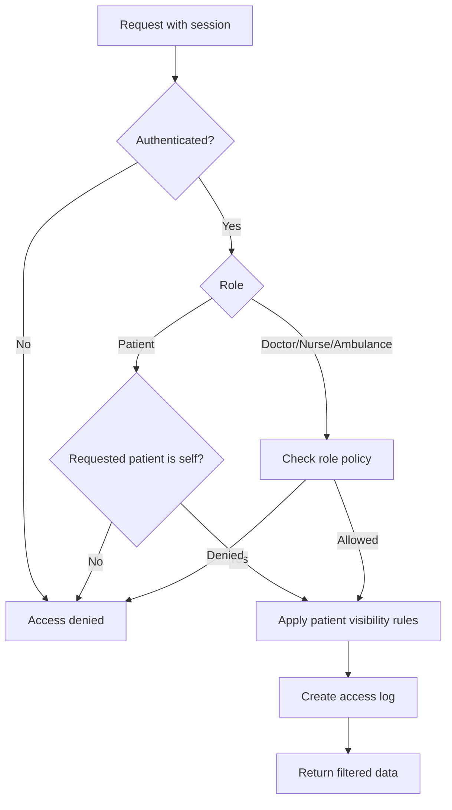

# Task: User Roles & Access Control

## Metadata

- **Priority:** P0 - Critical
- **Deadline:** 2026-09-24
- **Status:** DOING
- **Assignee:** rcilomba
- **Tags:** security, roles, access-control, required, gate:4-integration
- **Dependencies:** 11-backend-api-auth.md, 12-frontend-ui.md, 13-patient-view-search.md, 14-medical-notes.md
- **Estimated Effort:** 6h

## Requirements

- Distinct application roles with different permissions
- Patients cannot manipulate URLs to access other data
- Unauthorized users see "Access Denied" page
- Role-based UI that adapts to logged-in user
- Secure access control on both frontend and backend

## User Stories

- As a patient, I want the server to reject a tampered patient ID so that I can access only my own journal.
- As healthcare staff, I want permissions enforced by role so that I see only authorized data.
- As an unauthorized user, I want a clear access-denied page so that no patient data is revealed.

## Test-First Checkpoint

- Write a permission matrix test for all five roles before implementing middleware or frontend guards.
- Include URL tampering and access-denied cases as mandatory regression tests.

## Design

### User Stories

- As a patient, I want the server to ignore a tampered patient ID in the URL so that I can only access my own journal.
- As a doctor, nurse, or ambulance worker, I want permissions enforced by role so that I see only data I am authorized to access.
- As an unauthorized user, I want a clear access-denied page so that no patient data is accidentally revealed.

### Authorization Decision Flow

```mermaid
flowchart TD
    R[Request with session] --> A{Authenticated?}
    A -- No --> D[Access denied]
    A -- Yes --> O{Role}
    O -- Patient --> P{Requested patient is self?}
    P -- No --> D
    P -- Yes --> V[Apply patient visibility rules]
    O -- Doctor/Nurse/Ambulance --> S[Check role policy]
    S -- Denied --> D
    S -- Allowed --> V
    V --> L[Create access log]
    L --> X[Return filtered data]
```

### Role Definitions

The current application supports five role values. Permissions are defined in application code in
`src/lib/auth/permissions.ts`; they are not stored as database permission rows. The database stores
each user's role and optional organization relation.

| Role           | Search patients | Read journals    | Create and manage own notes | Read access logs      |
| -------------- | --------------- | ---------------- | --------------------------- | --------------------- |
| `doctor`       | All patients    | All patients     | Yes                         | All logs              |
| `nurse`        | All patients    | All patients     | Yes                         | All logs              |
| `ambulance`    | All patients    | All patients     | Yes                         | All logs              |
| `patient`      | No              | Own journal only | No                          | Own patient logs only |
| `unauthorized` | No              | No               | No                          | No                    |

Notes marked `all` are visible to patients. Healthcare notes are visible to staff. Private notes are
visible only to their author. A note can only be edited or deleted by its author.

Healthcare organization (vårdcentral) is not currently a login role. Organization IDs exist in the
data model and session, but they do not yet restrict patient search, journals, notes, or access logs.
Organization-scoped access remains an explicit open decision rather than a completed permission.

### Denied Access

- Missing or invalid JWT sessions receive `401 UNAUTHENTICATED`.
- Authenticated users without the required permission receive `403 UNAUTHORIZED`.
- Patients requesting another patient ID receive `403` from the API and an immediate Access Denied
  state in the frontend before journal data is requested.
- Forged `x-mock-role` and `x-mock-user-id` headers do not grant access.
- The internal P2P access-log route has a separate trust model that remains to be decided.

### Access Control Implementation

- `src/lib/auth.ts` verifies the JWT session and exposes `requirePermission()` for API routes.
- `src/lib/auth/permissions.ts` maps each supported role to permissions and validates patient
  ownership.
- Protected API routes enforce permissions server-side before reading or changing data.
- Frontend pages read the verified session from `/api/auth/me` or on the server and hide or block
  views that the role cannot use.
- The database relation between `User` and `Patient` supplies the patient's own journal ID.

### URL Manipulation Prevention

`GET /api/patients/:id` compares the requested patient ID with `SessionUser.patientId` for patient
accounts and returns `403` on a mismatch. The `/patients/[id]` frontend performs the same ownership
check before mounting the journal component, so protected journal data is never requested after URL
tampering. The server check remains authoritative.

## Tasks

- [x] Define role permissions in application code
- [x] Create role-based middleware for backend
- [x] Implement patient ownership validation
- [x] Create frontend role guards
- [x] Implement "Access Denied" page for unauthorized
- [x] Test URL manipulation attempts
- [x] Document all permission rules
- [x] Create role-based seed data

## Done Criteria

- [x] All currently supported roles have defined permissions
- [x] Backend enforces role-based access
- [x] Patients cannot access other patients' data
- [x] URL manipulation is prevented
- [x] Unauthorized users see proper error page
- [x] Frontend adapts to user role
- [x] All permission rules are documented
- [x] Test cases cover all role combinations

## Implementation

- Role permissions are centralized in `src/lib/auth/permissions.ts`.
- The database stores user roles and organization relations, not the permission matrix itself.
- Protected API routes authorize the JWT session with `requirePermission`.
- Patient ownership comes from the SQL relation between `users` and `patients`.
- Mock authentication headers are no longer accepted by protected routes.
- The role matrix, URL tampering, forged headers, and Access Denied flow are covered in
  `e2e/auth/access-control.spec.ts`.
- Healthcare organization roles and organization-based scoping are explicitly deferred from this
  task and remain open for a later implementation decision.

## Notes

- Always validate permissions on backend, never trust frontend
- Use middleware pattern for clean code organization
- Consider using a permissions library like CASL or AccessControl
- Log all access attempts for security auditing
- Make sure to handle edge cases (e.g., patient trying to access non-existent record)

## Questions to Resolve

- [ ] How to handle organization-based access for vårdcentral?
- [ ] Should we implement audit logging for all access attempts?
- [ ] How to handle role changes (e.g., nurse becomes doctor)?
- [ ] Should we implement session timeout?
