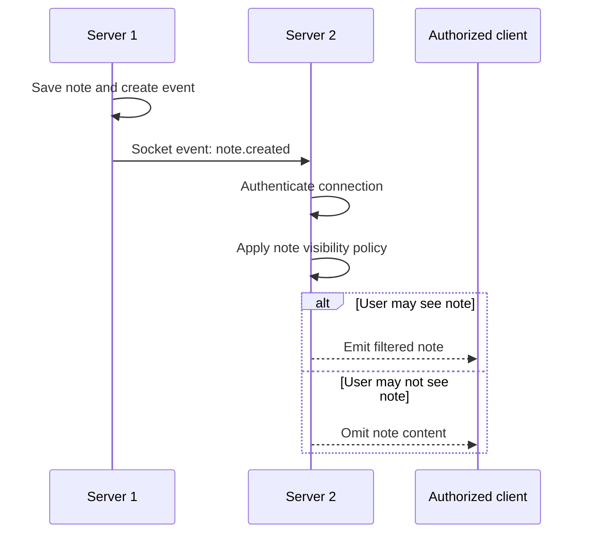

# Task: Socket.io Broadcasting

## Metadata

- **Priority:** P0 - Critical
- **Deadline:** 2026-09-21
- **Status:** TODO
- **Assignee:** umoraghad0-del (pair-programmering)
- **Tags:** realtime, websocket, socketio, required, gate:4-integration
- **Dependencies:** 17-user-roles-access-control.md, 14-medical-notes.md, 16-p2p-network.md, 12-frontend-ui.md
- **Related:** 15-blockchain-access-logging.md
- **Estimated Effort:** 5h

## Requirements

- Real-time updates when medical notes are created
- If person on Server 1 creates note, it should appear on Server 2
- Use sockets/broadcasting for real-time sync

## User Stories

- As a user on server 2, I want an authorized note created on server 1 to appear without refreshing.
- As a patient, I want real-time updates filtered by my permissions so that broadcasts never leak protected notes.
- As the system, I want reconnection and duplicate-event handling so temporary network failures do not corrupt the list.
- Handle multiple simultaneous connections
- Graceful disconnection handling

## Test-First Checkpoint

- Write a real-time test for an authorized recipient and a non-recipient before implementing broadcasting.
- Assert that reconnecting does not duplicate a note and that a protected note is never emitted to an unauthorized client.

## Design

### User Stories

- As a user on server 2, I want an authorized note created on server 1 to appear without refreshing so that both locations see current information.
- As a patient, I want real-time updates filtered by my permissions so that a broadcast never leaks a private or healthcare-only note.
- As the system, I want reconnection and duplicate-event handling so that temporary network failures do not corrupt the displayed list.

### Broadcast and Filter Flow



### Socket.io Events

```javascript
// Server-side events
const events = {
  // Client -> Server
  JOIN_PATIENT: "join_patient_room",
  LEAVE_PATIENT: "leave_patient_room",
  CREATE_NOTE: "create_note",
  REQUEST_SYNC: "request_sync",

  // Server -> Client
  NEW_NOTE: "new_note",
  UPDATED_NOTE: "updated_note",
  ACCESS_LOG: "access_log",
  SYNC_COMPLETE: "sync_complete",
  ERROR: "error",
};
```

### Room-based Broadcasting

```
Patient Room Structure:
├── patient_123
│   ├── user_456 (Doctor on Server 1)
│   ├── user_789 (Nurse on Server 2)
│   └── user_123 (Patient themselves)
├── patient_456
│   └── ...
└── ...
```

### Real-time Flow

```
1. Doctor on Server 1 creates note for Patient 123
2. Note is saved to database
3. Note is added to blockchain
4. Socket.io emits 'new_note' to patient_123 room
5. All clients in room receive update
6. Nurse on Server 2 sees new note appear
7. Patient on mobile sees note appear
8. Access log is generated for all viewers
```

### Connection Management

```javascript
// Server-side socket handling
io.on("connection", (socket) => {
  console.log(`Client connected: ${socket.id}`);

  // Join patient room
  socket.on("join_patient_room", (patientId) => {
    socket.join(`patient_${patientId}`);
    console.log(`${socket.id} joined patient_${patientId}`);
  });

  // Create note and broadcast
  socket.on("create_note", async (data) => {
    const note = await createNote(data);

    // Broadcast to all in patient room
    io.to(`patient_${data.patientId}`).emit("new_note", {
      note,
      author: socket.userId,
      timestamp: Date.now(),
    });

    // Generate access log
    await generateAccessLog({
      userId: socket.userId,
      patientId: data.patientId,
      action: "create_note",
    });
  });

  // Handle disconnection
  socket.on("disconnect", () => {
    console.log(`Client disconnected: ${socket.id}`);
  });
});
```

### Frontend Integration

```javascript
// Client-side socket handling
import { io } from "socket.io-client";

const socket = io("http://localhost:3001");

// Join patient room when viewing patient
function viewPatient(patientId) {
  socket.emit("join_patient_room", patientId);
}

// Listen for new notes
socket.on("new_note", (data) => {
  console.log("New note received:", data);
  // Update UI with new note
  updateNotesList(data.note);
});

// Create note
function createNote(patientId, content, visibility) {
  socket.emit("create_note", {
    patientId,
    content,
    visibility,
  });
}
```

## Implementation Checklist

- [x] Set up Socket.io server
- [x] Implement room-based messaging
- [x] Create note creation with broadcasting
- [x] Add real-time note updates
- [x] Implement access log broadcasting
- [x] Handle multiple server instances
- [x] Add connection status indicator
- [x] Implement reconnection logic
- [x] Add error handling for socket events
- [x] Test with multiple browsers/tabs (Playwright e2e covers cross-server delivery)

## Done Criteria

- [x] Notes appear in real-time across servers
- [x] Multiple users can view same patient simultaneously
- [x] Real-time updates work for notes and access logs
- [x] Connection status is shown to users
- [x] Disconnections are handled gracefully
- [x] Reconnection works automatically
- [x] Multiple server instances work together
- [x] Socket events are properly authenticated
- [x] Error messages are displayed to users
- [ ] Performance is acceptable with many connections (not load-tested)

## Notes

- Use rooms for efficient broadcasting
- Implement heartbeat for connection monitoring
- Consider using Redis adapter for scaling
- Log socket events for debugging
- Add rate limiting to prevent abuse

## Questions to Resolve

- [ ] Should we use Redis adapter for scaling? (open — single-pair demo works without it)
- [x] How to handle socket authentication? (JWT session cookie verified at handshake + peer shared secret for P2P calls)
- [x] What's the reconnection strategy? (socket.io-client auto-reconnect, 5 attempts, client-side note dedup on resync)
- [ ] Should we implement message acknowledgments? (open — current flow relies on client-side dedup instead)
